## 1.**Arduino Uno**
ແມ່ນແຜ່ນວົງຈອນຄວບຄຸມຂະຫນາດນ້ອຍ (microcontroller board) ທີ່ນິຍົມທີ່ສຸດ ແລະ ໃຊ້ງ່າຍ ສຳລັບການຮຽນຮູ້ດ້ານເອເລັກໂຕຣນິກ ແລະ ການຂຽນໂປຣແກຣມ. ມັນຖືກໃຊ້ກັນຢ່າງກວ້າງໃນການທົດລອງ, ສ້າງໂຄງການ, ແລະ ເຄື່ອງຈັກອັດຕະໂນມັດ.
	 #ການໃຊ້ງານຂອງອຸປະກອນ
	- ບັງຄັບໂລບອດ ແລະ ຫຸ່ນຍົນ
	- ອຸປະກອນ IoT (ຕໍ່ Wi-Fi / Bluetooth)
	- ຄວບຄຸມເຮືອນອັດຕະໂນມັດ
	- ບັນທຶກຂໍ້ມູນ (Data logging)
	- ໂຄງການຮຽນຮູ້ທາງເອເລັກໂຕຣນິກ

#ຕົວຢ່າງການນຳໃຊ້ອຸປະກອນ 
	 ~ຂຽນໂປຣແກຣມໃນ **Arduino IDE** (ໃຊ້ພາສາ C/C++)
	 ~ອັບໂຫລດໂປຣແກຣມເຂົ້າບອດຜ່ານ USB
	~ໄມໂຄຣຄອນໂທຣລ໌ເລີຈະປະມວນຜົນແລະຄວບຄຸມຂາອອກ-ຂາເຂົ້າ
	    - ຂາເຂົ້າ: ຮັບຄ່າຈາກເຊັນເຊີ, ປຸ່ມ
	    - ຂາອອກ: ຄວບຄຸມໄຟ LED, ມໍເຕີ
## 2.**Breadboard**
ແມ່ນອຸປະກອນສຳລັບທົດລອງວົງຈອນໄຟຟ້າໂດຍ **ບໍ່ຈຳເປັນຕ້ອງບັດຕົວສາຍ (ບໍ່ຕ້ອງບັດຫຼືບໍດຕະກະ)**  
	ໃຊ້ສຳລັບຕໍ່ສາຍອຸປະກອນເຊັ່ນ **LED, Resistor, Sensor, Arduino** ເພື່ອທົດລອງການເຮັດວຽກຂອງວົງຈອນກ່ອນທີ່ຈະຜະລິດຈິງ.
	#ການໃຊ້ງານຂອງອຸປະກອນ
	1. ຕໍ່ສາຍບວກ (5V) ແລະ ສາຍລົບ (GND) ຈາກ Arduino ເຂົ້າ power rails.
	2. ໃສ່ອຸປະກອນເຊັ່ນ LED ຫຼື Resistor ລົງໃນແຖວກາງ.
	3. ໃຊ້ສາຍ jumper ຕໍ່ຈາກຂາ Arduino ມາຫາຈຸດທີ່ຕ້ອງການໃນ breadboard.
	4. ອັບໂຫລດໂປຣແກຣມໃສ່ Arduino ແລ້ວທົດລອງເບິ່ງຜົນ.

#ຕົວຢ່າງການນຳໃຊ້ Breadboard
- ຕໍ່ LED ໃຫ້ກະພິບກັບ Arduino
- ທົດລອງວົງຈອນຕົວຕ້ານ (Resistor)
- ຕໍ່ວົງຈອນ sensor ເຊັ່ນ LDR, DHT11, Ultrasonic
- ທົດລອງວົງຈອນມໍເຕີຫຼືສຽງ (Buzzer)
## 3.**USB Cable (Universal Serial Bus)** 
 ແມ່ນສາຍທີ່ໃຊ້ເພື່ອ: ເຊື່ອມຕໍ່ **ຄອມພິວເຕີ** ກັບ **ອຸປະກອນອື່ນ** (ເຊັ່ນ: Arduino, ກ້ອງ, ປຣິ້ນເຕີ) ແລະ ສົ່ງຜ່ານຂໍ້ມູນ ແລະ ຈ່າຍໄຟໃຫ້ອຸປະກອນນັ້ນ
 #ການໃຊ້ງານຂອງອຸປະກອນ
 
🔋 **ຈ່າຍໄຟ**|ສົ່ງໄຟຟ້າ 5V ຈາກຄອມພິວເຕີໄປຫາ Arduino ໃຫ້ບອດເຮັດວຽກ
💾 **ສົ່ງຂໍ້ມູນ**|ສົ່ງໂປຣແກຣມຈາກ Arduino IDE ໃນຄອມພິວເຕີ ໄປຫາບອດ Arduino
🔁 **ຮັບຂໍ້ມູນກັບຄືນ**|ໃຊ້ຮັບຂໍ້ມູນຈາກ Arduino ກັບຄືນໄປຫາຄອມ (ເຊັ່ນຂໍ້ມູນຈາກ sensor)

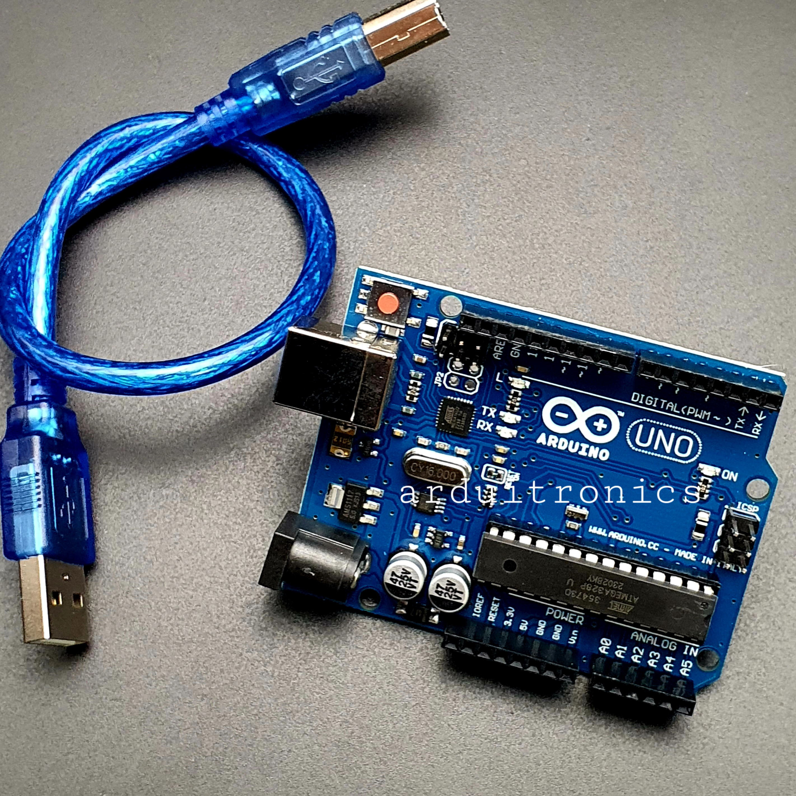

#ຕົວຢ່າງການນຳໃຊ້ 
	USB Cable ກັບ Arduino Uno
	🔹 1. ຕໍ່ສາຍ
	- ສຽບ **ດ້ານ Type B** ເຂົ້າບອດ Arduino Uno
	- ສຽບ **ດ້ານ Type A** ເຂົ້າພອດ USB ຂອງຄອມພິວເຕີ
	👉 ເມື່ອສຽບແລ້ວ, ໄຟທີ່ບອດຈະຕິດ (ໄຟ Power LED)  
	ຊີ້ວ່າບອດໄດ້ຮັບໄຟແລ້ວ ✅
	🔹2. ເປີດໂປຣແກຣມ Arduino IDE
	- ເລືອກ  
	    **Tools → Board → Arduino Uno**  
	    **Tools → Port → COMx (ພອດຂອງ Arduino)
	🔹3. ອັບໂຫລດໂປຣແກຣມ
	- ຂຽນໂປຣແກຣມໃນ Arduino IDE
	- ກົດປຸ່ມ **Upload (ຮູບລູກສອນຂຶ້ນ)**  
	    → USB Cable ຈະສົ່ງໂປຣແກຣມໄປຫາ Arduino Uno  
	    → ເມື່ອສຳເລັດ, ບອດຈະເຮັດຕາມຄຳສັ່ງນັ້ນ
	    
🔹4. ຮັບຂໍ້ມູນກັບຄືນ
	ຖ້າທ່ານໃຊ້ sensor (ເຊັ່ນ ອ່ານອຸນຫະພູມ, ການກົດປຸ່ມ)  
	ບອດຈະສົ່ງຂໍ້ມູນກັບຜ່ານ USB ໄປຫາ **Serial Monitor** ໃນ Arduino IDE.
## 4. Jumper wires (male-to-male)
ແມ່ນສາຍຕໍ່ຂະຫນາດນ້ອຍ ທີ່ໃຊ້ເພື່ອເຊື່ອມຕໍ່ວົງຈອນໄຟຟ້າ ໃນ **Breadboard** ຫຼື ລະຫວ່າງ Breadboard ກັບ Arduino.
#ການໃຊ້ງານຂອງອຸປະກອນ

🔹 Male to Male (ຜູ້ – ຜູ້)|ປາຍທັງສອງເປັນເຫຼັກແທງ|ຕໍ່ລະຫວ່າງ breadboard ກັບ breadboard ຫຼື breadboard ກັບ Arduino.
🔸 Male to Female (ຜູ້ – ຍິງ)|ປາຍໜຶ່ງເປັນເຫຼັກ, ອີກປາຍໜຶ່ງເປັນຮູ|ຕໍ່ຈາກ Arduino ໄປຫາ sensor ຫຼື module ທີ່ມີຂາຜູ້.
🔸 Female to Female (ຍິງ – ຍິງ)|ທັງສອງປາຍເປັນຮູ|ຕໍ່ລະຫວ່າງ module ຫຼື sensor ທີ່ມີຂາຜູ້.

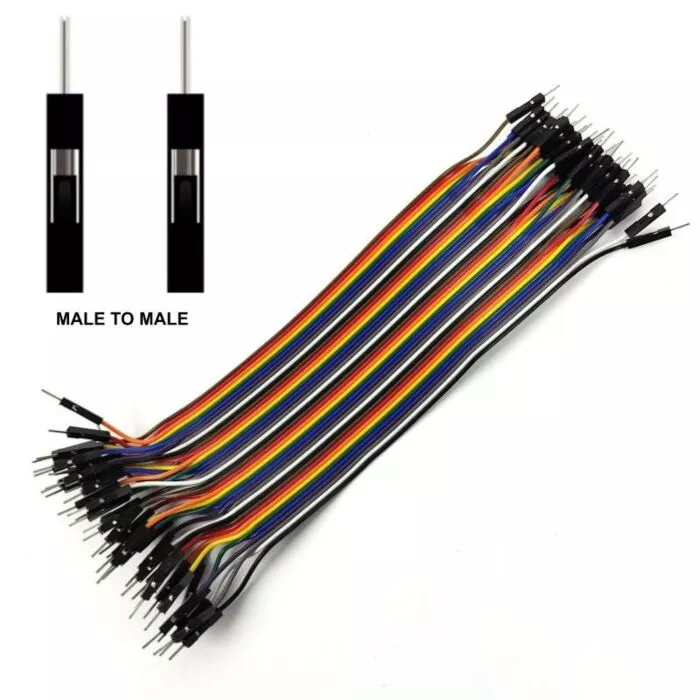
#ຕົວຢ່າງການນຳໃຊ້
	ຕໍ່ LED ຜ່ານ Breadboard
	- Jumper 1: D13 (Arduino) → ຂາບວກ LED
	- Jumper 2: GND (Arduino) → ຂາລົບ LED (ຜ່ານ Resistor)
	🔹 2. ຕໍ່ລະຫວ່າງອຸປະກອນໃນ Breadboard
	- ເຊື່ອມຈາກຈຸດໜຶ່ງໄປອີກຈຸດໜຶ່ງໃນ Breadboard ເພື່ອສົ່ງໄຟຫຼືສັນຍານ
	📘 ຕົວຢ່າງ:
	- ຕໍ່ສາຍຈາກແຖວ + (5V) ໄປຫາອຸປະກອນທີ່ຢູ່ອີກຝັ່ງ
	- ຕໍ່ສາຍຈາກແຖວ – (GND) ໄປຫາຂາລົບຂອງອຸປະກອນ
## 5.  Jumper wires (male-to-female)
ແມ່ນສາຍໄຟນ້ອຍໆ, ທີ່ມີຄວາມຢືດຢຸ່ນ ທີ່ໃຊ້ເພື່ອເຊື່ອມຕໍ່ອົງປະກອບຕ່າງໆ ເທິງແຜງວົງຈອນທົດລອງ (breadboard) ເຂົ້າຫາກັນ, ຫຼື ເຊື່ອມຕໍ່ອົງປະກອບເທິງ breadboard ເຂົ້າກັບຂາ pin ຂອງໄມໂຄຣຄອນໂທຣເລີ (microcontroller) ຫຼື ແຜງພັດທະນາ (development board). ມັນໃຊ້ໃນການສົ່ງສັນຍານໄຟຟ້າ ຫຼື ພະລັງງານ.
#ການໃຊ້ງານຂອງອຸປະກອນ
	ການຈັດວາງແບບ ໂຕຜູ້ຫາໂຕແມ່ ແມ່ນຖືກອອກແບບມາສະເພາະເພື່ອ:
	- **ເຊື່ອມຕໍ່ຂາ pin ໂຕຜູ້ (male header pin) ເທິງອົງປະກອບ ຫຼື ແຜງພັດທະນາ** (ເຊັ່ນ: ຂາ pin I/O ຂອງ **Arduino UNO**, ຫຼື ຂາ pin ຂອງເຊັນເຊີ) **ໂດຍກົງກັບຮູສຽບໂຕແມ່ (female socket)** (ເຊັ່ນ: ຮູຂອງແຜງ breadboard).
	- **ເຊື່ອມຕໍ່ຂາ pin ຂອງແຜງພັດທະນາ** (ເຊິ່ງໂດຍປົກກະຕິແລ້ວແມ່ນໂຕຜູ້) **ເຂົ້າກັບຂາ pin ໂຕແມ່ຂອງໂມດູນ ຫຼື ອົງປະກອບອື່ນ**.
	- **ຂະຫຍາຍການເຊື່ອມຕໍ່** ຈາກຂາ pin ຂອງໄມໂຄຣຄອນໂທຣເລີ ໄປຫາອົງປະກອບທີ່ຢູ່ໄກອອກໄປ ໂດຍບໍ່ຕ້ອງໃຊ້ breadboard
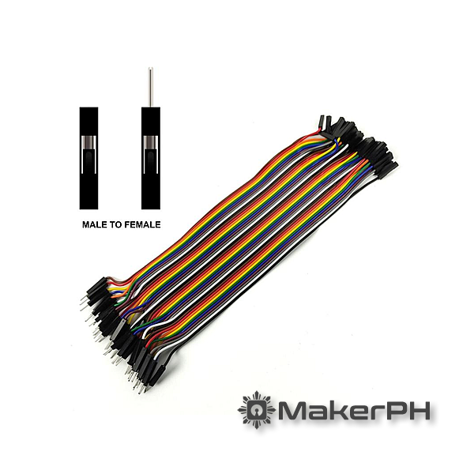
#ຕົວຢ່າງການນຳໃຊ້
	ໂຕຜູ້ຫາໂຕຜູ້ (M/M)ຂາ Pin ໂຕຜູ້ຂາ Pin ໂຕຜູ້ເຊື່ອມຕໍ່ຈຸດຕ່າງໆ ເທິງ **breadboard.ໂຕແມ່ຫາໂຕແມ່ (F/F)ຮູສຽບໂຕແມ່ຮູສຽບໂຕແມ່ເຊື່ອມຕໍ່ອົງປະກອບສອງອັນ ທີ່ມີ **ຂາ pin ໂຕຜູ້.ໂຕຜູ້ຫາໂຕແມ່ (M/F)ຂາ Pin ໂຕຜູ້ຮູສຽບໂຕແມ່ເຊື່ອມຕໍ່ ແຜງພັດທະນາ (ຂາ pin ໂຕຜູ້) ເຂົ້າກັບ breadboard ຫຼື ເຊັນເຊີ (ຮູສຽບໂຕແມ່).
## 6.  Jumper wires (female-to-female)
ແມ່ນເຄື່ອງມືທົ່ວໄປ ແລະ ສໍາຄັນອີກອັນໜຶ່ງໃນການສ້າງຮູບແບບທາງອີເລັກໂທຣນິກ, ເຊິ່ງມັກຈະຖືກໃຊ້ຄຽງຄູ່ກັບປະເພດ ໂຕຜູ້ຫາໂຕຜູ້ ແລະ ໂຕຜູ້ຫາໂຕແມ່.
#ການໃຊ້ງານຂອງອຸປະກອນ 
	ສາຍຈຳເປີ F/F ຖືກໃຊ້ຕົ້ນຕໍເພື່ອເຊື່ອມຕໍ່ອົງປະກອບສອງອັນທີ່ລ້ວນແຕ່ມີຂາ pin ໂຕຜູ້ມາດຕະຖານ. ການຈັດວາງແບບນີ້ຊ່ວຍໃຫ້ທ່ານເຊື່ອມຕໍ່ແຜງວົງຈອນ ຫຼື ໂມດູນສອງອັນເຂົ້າກັນໄດ້, ໂດຍບໍ່ຈຳເປັນຕ້ອງມີແຜງວົງຈອນທົດລອງ (breadboard) ໃນບາງກໍລະນີ.
	1.ເຊື່ອມຕໍ່ແຜງວົງຈອນພັດທະນາສອງອັນ:ຖ້າທ່ານຕ້ອງການສົ່ງສັນຍານໂດຍກົງຈາກຂາ pin I/O ໂຕຜູ້ເທິງ **Arduino** ຫຼື **Raspberry Pi** ໜຶ່ງ ໄປຫາຂາ pin I/O ໂຕຜູ້ເທິງແຜງວົງຈອນ _ອັນທີສອງ_, ສາຍ F/F ແມ່ນເໝາະສົມທີ່ສຸດ.
	2.ເຊື່ອມຕໍ່ເຊັນເຊີເຂົ້າກັບໂມດູນ: ແຜງເຊັນເຊີຫຼາຍອັນ, ເຊັ່ນ: ເຊັນເຊີອຸນຫະພູມ ຫຼື ຄວາມຊຸ່ມຊື່ນແບບງ່າຍໆ, ມີຂາ pin ໂຕຜູ້ເພື່ອໃຫ້ງ່າຍຕໍ່ການເຊື່ອມຕໍ່. ສາຍ F/F ຈະສຽບເຂົ້າກັບຂາ pin ຂອງເຊັນເຊີ ແລະ ຈາກນັ້ນສຽບເຂົ້າກັບຂາ pin ຂອງແຜງວົງຈອນຫຼັກ (ເຊັ່ນ: Arduino).
	3.ຂະຫຍາຍຂາ pin ໂຕຜູ້: ຖ້າອົງປະກອບທີ່ມີຂາ pin ໂຕຜູ້ຢູ່ໄກຈາກຂາ pin ໂຕຜູ້ເທິງແຜງວົງຈອນຫຼັກຂອງທ່ານ, ສາຍ F/F ຈະເຊື່ອມຕໍ່ໂດຍກົງໃສ່ທັງສອງເພື່ອສ້າງການເຊື່ອມຕໍ່ທີ່ສະອາດ ແລະ ຍາວອອກໄປ.
	4.ການເຊື່ອມຕໍ່ກັບ Breadboard: ມັນບໍ່ຄ່ອຍຖືກໃຊ້ໂດຍກົງກັບແຜງວົງຈອນທົດລອງມາດຕະຖານ, ເນື່ອງຈາກ breadboard ເອງມີຮູສຽບໂຕແມ່.
		
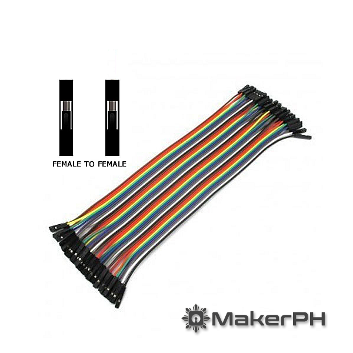
#ຕົວຢ່າງການນຳໃຊ້ 
	-ຂາ pin Arduino(ໂຕຜູ້) $\rightarrow$ **ຂາ pin ເຊັນເຊີ** (ໂຕຜູ້)|**ໂຕແມ່ຫາໂຕແມ່ (F/F)**|ຕ້ອງການຮູສຽບທັງສອງປາຍເພື່ອສຽບໃສ່ຂາ pin ໂຕຜູ້ທັງສອງ.|
	-ຂາ pin Arduino (ໂຕຜູ້) $\rightarrow$ **Breadboard** (ໂຕແມ່)|ໂຕຜູ້ຫາໂຕແມ່ (M/F)|ປາຍໂຕຜູ້ສຽບເຂົ້າໄປໃນຮູສຽບໂຕແມ່ຂອງ breadboard.|
	-Breadboard (ໂຕແມ່) $\rightarrow$ **Breadboard** (ໂຕແມ່)|ໂຕຜູ້ຫາໂຕຜູ້ (M/M)|ຕ້ອງການຂາ pin ທັງສອງປາຍເພື່ອສຽບເຂົ້າໄປໃນຮູສຽບໂຕແມ່ທັງສອງ.|
## 7.  9V Battery Connector
ແມ່ນອຸປະກອນນ້ອຍໆ ທີ່ໃຊ້ເພື່ອ **ເຊື່ອມຕໍ່ແບັດເຕີຣີ 9V ກັບວົງຈອນໄຟຟ້າ ຫຼື ບອດອິເລັກໂຕຣນິກ** ເຊັ່ນ **Arduino, breadboard ຫຼື project board**.
#ການໃຊ້ງານຂອງອຸປະກອນ 
	- ຕໍ່ຫົວຄລິບໃສ່ແບັດເຕີຣີ 9V 
	    → ໃຫ້ຂົ້ວບວກແລະຂົ້ວລົບຕິດກັນພອດດີ
	- ນຳສາຍໄຟສອງເສັ້ນໄປຕໍ່ໃນວົງຈອນ
	    - ສາຍສີແດງ → ຕໍ່ກັບ **VCC ຫຼື +**
	    - ສາຍສີດຳ → ຕໍ່ກັບ **GND ຫຼື -**
	- ນຳໄປຈ່າຍໄຟໃຫ້ອຸປະກອນທີ່ໃຊ້ໄຟ 9V 
	    ເຊັ່ນ Arduino, motor driver, ຫຼື LED project
	
#ຕົວຢ່າງການນຳໃຊ້ 
	ໃຊ້ຫົວຕໍ່ແບັດເຕີຣີ 9V ເພື່ອຈ່າຍໄຟໃຫ້ບອດ **Arduino Uno**  
	ສາມາດເສຽບໄດ້ 2 ວິທີ:
	1. ຕໍ່ຜ່ານ **ຮູ DC Jack (2.1mm)** ທີ່ຢູ່ເທິງບອດ
	2. ຫຼືຕໍ່ຜ່ານ **Pin Vin ແລະ GND** (ຕ້ອງລະວັງຂົ້ວບວກ/ລົບໃຫ້ຖືກ)
## 8. LEDs (Red: 5, Yellow: 5, Blue: 5, RGB: 1)
LED ແມ່ນໄດໂອດທີ່ສາມາດປ່ອຍແສງອອກມາໄດ້ເມື່ອມີໄຟຟ້າໄຫຼຜ່ານ. ມັນໃຊ້ພະລັງງານນ້ອຍ ແລະ ມີອາຍຸການໃຊ້ງານຍາວ.
### 🔴🟡🔵 **LED ສີດຽວ (Single Color LEDs)**
	ໃນຊຸດນີ້ມີ:
- 🔴 **LED ສີແດງ 5 ດວງ**
- 🟡 **LED ສີເຫຼືອງ 5 ດວງ**
- 🔵 **LED ສີນ້ຳເງິນ 5 ດວງ**
📘 **ຂໍ້ມູນທົ່ວໄປ**
- ຂົ້ວຍາວ = ຂົ້ວບວກ (+)
- ຂົ້ວສັ້ນ = ຂົ້ວລົບ (-)
- ມັກໃຊ້ໄຟຟ້າປະມານ **2V – 3V** ແລະ ຈຳເປັນຕ້ອງຕໍ່ຕົວຕ້ານ (Resistor) ເພື່ອຈຳກັດກະແສໄຟ
#ການໃຊ້ງານຂອງອຸປະກອນ 
	LEDs ນີ້ສາມາດໃຊ້ໃນການ:
- ທົດລອງກັບ **Arduino Uno**
- ສ້າງໂຄງການໄຟສະຫວ່າງ, ສັນຍານ, ຫຼືການຊີ້ບອກສະຖານະ
- ຝຶກຂຽນໂຄດຄວບຄຸມການເປີດ–ປິດຫຼືປ່ຽນສີ

#ຕົວຢ່າງການນຳໃຊ້ 
#**ການເປີດ–ປິດ LED ສີແດງ**
#🧰 ອຸປະກອນ:
- Arduino Uno
- LED ສີແດງ 1 ດວງ
- ຕົວຕ້ານ 220Ω
- Jumper wires
#⚙️ ວິທີຕໍ່:
- **ຂາຍາວ ( + )** ຂອງ LED → ຕໍ່ກັບ pin **13** ຂອງ Arduino
- **ຂາສັ້ນ ( - )** → ຕໍ່ຜ່ານຕົວຕ້ານ 220Ω ແລ້ວໄປຫາ **GND**
## 9. RGB module
  ແມ່ນບອດນ້ອຍໆ ທີ່ມີຫຼອດ **RGB LED** ຕິດຢູ່ໃນຕົວມັນ ພ້ອມຂາຕໍ່ທີ່ສະດວກສຳລັບເຊື່ອມກັບ Arduino ຫຼື microcontroller.  
ຄຳວ່າ **RGB** ໝາຍເຖິງສີ 3 ສີພື້ນຖານ:
- 🔴 **Red (ແດງ)**
- 🟢 **Green (ຂຽວ)**
- 🔵 **Blue (ຟ້າ)**
ການຜສົມສີທັງ 3 ນີ້ໃນປະລິມານທີ່ແຕກຕ່າງກັນ ຈະສາມາດສ້າງສີໄດ້ຫຼາຍຮ້ອຍສີ! 🎨
#ການໃຊ້ງານຂອງອຸປະກອນ 
- 🔴 **R (Red pin)** – ຂາຄວບຄຸມແສງສີແດງ
- 🟢 **G (Green pin)** – ຂາຄວບຄຸມແສງສີຂຽວ
- 🔵 **B (Blue pin)** – ຂາຄວບຄຸມແສງສີຟ້າ
- ⚫ **GND** – ຂົ້ວລົບ (ຕໍ່ກັບ Ground)
- ໃນບາງຮຸ່ນອາດມີ **VCC (5V)** ຖ້າເປັນແບບ Common Cathode

#ຕົວຢ່າງການນຳໃຊ້ 
#🔸 **1. ການສະແດງສີຕ່າງໆ ດ້ວຍ Arduino**
ທົດລອງໃຫ້ RGB ປ່ຽນສີທີລະສີທຸກ 1 ວິນາທີ
🔹**ອຸປະກອນທີ່ໃຊ້**
- Arduino Uno
- RGB Module (Common Cathode)
- Jumper Wires
- ຕົວຕ້ານ 220Ω ຫຼື 330Ω (3 ຕົວ)
🔹 **ການຕໍ່ສາຍ**

|RGB Module|Arduino Uno|
|---|---|
|R|Pin 9|
|G|Pin 10|
|B|Pin 11|
|GND|GND|
🎯 **ຜົນທີ່ໄດ້:**  
RGB LED ຈະປ່ຽນສີອັດຕະໂນມັດໃນທຸກ 1 ວິນາທີ (ແດງ → ຂຽວ → ຟ້າ → ເຫຼືອງ → ຟ້າອ່ອນ → ມ່ວງ → ຂາວ)
# 10. Resistors (220Ω, 1kΩ, 10kΩ)
ແມ່ນອຸປະກອນອິເລັກໂຕຣນິກທີ່ໃຊ້ເພື່ອຈຳກັດຫຼືຄວບຄຸມປະລິມານໄຟຟ້າ (ກະແສໄຟ) ທີ່ໄຫຼໃນວົງຈອນ 🔌
#ການໃຊ້ງານຂອງອຸປະກອນ 
- **ຈຳກັດກະແສໄຟຟ້າ** – ປ້ອງກັນອຸປະກອນອື່ນໆ ບໍ່ໃຫ້ໄດ້ຮັບໄຟຟ້າເກີນ
- **ແບ່ງແຮງດັນ (Voltage Divider)**
- **ໃຊ້ຮ່ວມກັບ LED** ເພື່ອຈຳກັດໄຟບໍ່ໃຫ້ຫຼາຍເກີນໄປ
- **ໃຊ້ໃນວົງຈອນວັດຄ່າ ຫຼື ກວດສອບສັນຍານ**
-ຄ່າຕົວຢ່າງ
#🔸 **220Ω (โอห์ม)**  ໃຊ້ກັບ **LED** ເພື່ອຈຳກັດກະແສໄຟ (ປ້ອງກັນຫຼອດແຕກ).
#🔸 **1kΩ (1,000Ω)**  ໃຊ້ເປັນ **Pull-up / Pull-down resistor** ໃນວົງຈອນຄວບຄຸມ.
#🔸 **10kΩ (10,000Ω)**  ໃຊ້ໃນວົງຈອນ **Sensor, Input Pin** ຫຼືເປັນຕົວຕ້ານທານອ້າງອີງ.

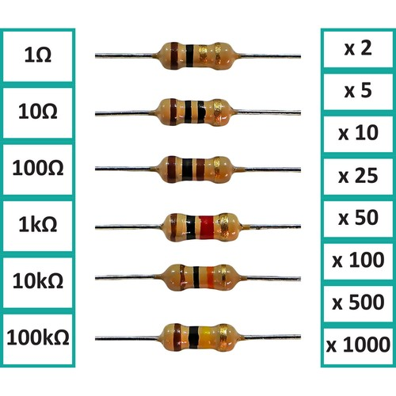
#ຕົວຢ່າງການນຳໃຊ້ 
🔹 **1. ຕົວຕ້ານທານ 220Ω ກັບ LED**
**ຈຸດປະສົງ:** ຈຳກັດກະແສໄຟຟ້າໃຫ້ LED ບໍ່ແຕກ  
**ວົງຈອນ:**
`[Arduino Pin 13] → [Resistor 220Ω] → [LED] → [GND]`
**ຜົນທີ່ໄດ້:** LED ສະຫວ່າງພອດດີ ແລະບໍ່ແຕກເມື່ອຈ່າຍໄຟ 5V
#🔹 2. ຕົວຕ້ານທານ 1kΩ ໃນວົງຈອນກົດປຸ່ມ (Push Button)
**ຈຸດປະສົງ:** ໃຊ້ເປັນ **Pull-down resistor** ເພື່ອໃຫ້ຂາ Input ບໍ່ຮັບຄ່າຜິດພາດ
**ວົງຈອນ:**
`[5V] → [Push Button] → [Arduino Pin 2] [Pin 2] → [Resistor 1kΩ] → [GND]`
**ຜົນທີ່ໄດ້:** ເມື່ອກົດປຸ່ມ → Arduino ຮັບຄ່າ HIGH  
ຖ້າບໍ່ກົດ → ຄ່າເປັນ LOW (ບໍ່ມີສັນຍານລອຍ)
###🔹 **3. ຕົວຕ້ານທານ 10kΩ ກັບ Sensor (ເຊັ່ນ LDR ຫຼື Thermistor)**
**ຈຸດປະສົງ:** ສ້າງວົງຈອນແບ່ງແຮງດັນ (Voltage Divider)
**ວົງຈອນ:**
`[5V] → [LDR] → [Analog Pin A0] → [Resistor 10kΩ] → [GND]`
**ຜົນທີ່ໄດ້:** ເມື່ອແສງເພີ່ມ → ຄ່າຕ້ານທານ LDR ຫຼຸດ  
Arduino ອ່ານໄດ້ຄ່າແຮງດັນທີ່ແຕກຕ່າງຕາມລະດັບແສງ
## 11. Push Buttons (x4 with Lids)
ແມ່ນອຸປະກອນອິເລັກໂຕຣນິກທີ່ໃຊ້ເພື່ອສ້າງ **input signal** ໃຫ້ກັບ Arduino ຫຼື microcontroller ໂດຍກົດປຸ່ມ → ສັນຍານ HIGH / LOW
#ການໃຊ້ງານຂອງອຸປະກອນ 
- **ເຊື່ອມ Push Button ກັບ Arduino**
    - ຂາໜຶ່ງ → 5V
    - ຂາອີກ → Input Pin (ຕົວຢ່າງ: Pin 2, 3, 4, 5)
    - ຕິດ **Pull-down resistor** 10kΩ ຈາກ Input Pin → GND
- **ຄ່າ Input**
    - ກົດປຸ່ມ → Pin = HIGH
    - ບໍ່ກົດ → Pin = LOW
    

    
    
#ຕົວຢ່າງການນຳໃຊ້ 
🔹 **1. ອຸປະກອນທີ່ຈຳເປັນ**
- Arduino Uno
- Push Buttons 4 ອັນ (ມີฝา)
- LED 4 ອັນ
- Resistors 220Ω (LED), 10kΩ (Pull-down)
- Jumper Wires
 🔹 **2. ວົງຈອນຕໍ່ຂາສັນຍານ**
**Push Button + Pull-down resistor + LED**

      `+5V        │       [Button1]        │ Arduino Pin 2 ──┐                 │                [10kΩ]                 │                GND                 Arduino Pin 9 → [220Ω] → [LED1] → GND`
      
- ຂົ້ວລົບ Pull-down 10kΩ ເພື່ອຮັບຄ່າ LOW ເມື່ອບໍ່ກົດ button
- LED1 ສະຫວ່າງເມື່ອ button ກົດ
 ສໍາລັບ Push Button 4 ອັນ ກໍຕໍ່ເຊື່ອມແບບດຽວ ຕາມ Pin 2–5, LED Pin 9–12.
## 12.Potentiometer (5kΩ)
ແມ່ນຕົວຕ້ານປ່ຽນຄ່າໄຟ (Variable Resistor) ທີ່ສາມາດປ່ຽນ **Resistance** ໄດ້ໂດຍການເຄື່ອນປຸ່ມຫຼືປຸ່ມເລື່ອນ (Knob/Slider)
- ຄ່າການຕໍ່ທົ່ວໄປ: 5kΩ (5,000 Ω)
- ເຊື່ອມກັບ Arduino ສໍາລັບ **Input Analog**
- ສາມາດນຳໄປຄວບຄຸມ LED, Servo, ຫຼື ອຸປະກອນອື່ນໆ
#ການໃຊ້ງານຂອງອຸປະກອນ 
1️⃣ **ເປັນ Variable Resistor**
- Potentiometer ແມ່ນຕົວຕ້ານທີ່ປ່ຽນຄ່າຄວາມຕໍ່ຕ้าน (Resistance) ໄດ້ໂດຍການເຄື່ອນ Knob / Slider
- ຄ່າ Resistance ຈະກຳນົດກະແສໄຟທີ່ຜ່ານວົງຈອນ
2️⃣ **ເປັນ Voltage Divider
- Pot ມັກນຳໄປສ້າງ **Voltage Divider** ເພື່ອໄດ້ຄ່າ Analog ຕໍ່ Arduino
- ໃຊ້ເພື່ອຄວບຄຸມ LED, Servo, Motor, ຫຼື Sensor

3️⃣ **ເຊື່ອມຕໍ່ງ່າຍ**
- ຂາສອງ → VCC / GND
- ຂາກາການອ່ານ → Analog Pin (A0–A5)
- ຄ່າອ່ານຈາກ 0–1023 (Arduino)
- ສາມາດ Map ໄປ 0–255 ສໍາລັບ PWM
4️⃣ **ເປັນ Input Control**
- ປ່ຽນໄຟ LED (Brightness)
- ຄວບຄຸມ Servo Motor (Position)
- ຄວບຄຸມ Volume, Speed, ຫຼື Sensor Value

#ຕົວຢ່າງການນຳໃຊ້ 
🔹 **1. ອຸປະກອນ**
- Arduino Uno
- Potentiometer 5kΩ
- LED ຕົວຢ່າງ (1 ອັນ)
- Resistor 220Ω (ກັບ LED)
- Jumper Wires
🔹 **2. ການເຊື່ອມຕໍ່ (Circuit Diagram)**

     `+5V       │      [Potentiometer]       │ Analog Pin A0 ──┐                 │                [LED] ── [220Ω] ── GND       │      GND`

- ຂາສອງຂອງ Pot → 5V / GND
- ຂາກາການອ່ານ → Analog Pin A0
- LED ຕໍ່ຜ່ານ Resistor 220Ω → GND
## 13.Active Buzzer
ແມ່ນອຸປະກອນທີ່ສ້າງສຽງດັງ (beep) ດ້ວຍຄວາມຖີ່ທີ່ຄົງທີ່ເມື່ອໄດ້ຮັບພະລັງງານໄຟຟ້າກະແສກົງ (DC voltage).
- **ມີວົງຈອນກຳເນີດສຽງໃນໂຕ:** Active Buzzer ມີ **Oscillator (ວົງຈອນສັ່ນ)** ສ້າງມາຢູ່ໃນໂຕ, ສະນັ້ນຈຶ່ງບໍ່ຈຳເປັນຕ້ອງໃຊ້ສັນຍານຄວາມຖີ່ພາຍນອກເພື່ອເຮັດໃຫ້ມັນສ້າງສຽງ. ພຽງແຕ່ປ້ອນແຮງດັນໄຟຟ້າທີ່ເໝາະສົມເທົ່ານັ້ນ, ມັນກໍຈະດັງທັນທີ.
- **ສຽງຄົງທີ່:** ຄວາມຖີ່ຂອງສຽງ (Tone) ແມ່ນຖືກກຳນົດໄວ້ແລ້ວຈາກໂຮງງານ (ເຊັ່ນ: $2.3 \text{kHz}$), ເຮັດໃຫ້ມັນບໍ່ສາມາດຫຼິ້ນສຽງຫຼາຍໂຕນ ຫຼື ສ້າງສຽງເພງທີ່ສັບຊ້ອນໄດ້ຄືກັບ Passive Buzzer.
- **ການໃຊ້ງານຄືກັບ LED:** ມັນເຮັດວຽກຄືກັບໄຟ LED, ເຮົາພຽງແຕ່ **ເປີດ (ON)** ຫຼື **ປິດ (OFF)** ເທົ່ານັ້ນ.
#ການໃຊ້ງານຂອງອຸປະກອນ 
1. ການເຊື່ອມຕໍ່
- **ຂາຕໍ່:** ໂດຍທົ່ວໄປ, Active Buzzer ຈະມີ 2 ຂາຄື:
    - **ຂາບວກ (+) ຫຼື $V_{CC}$:** ເຊື່ອມຕໍ່ກັບແຫຼ່ງພະລັງງານ ຫຼື ຂາສັນຍານ (Digital Pin) ຂອງໄມໂຄຄອນໂທຣນເລີ (ເຊັ່ນ: Arduino).
    - **ຂາລົບ (-) ຫຼື $GND$:** ເຊື່ອມຕໍ່ກັບຂາດິນ.
    - **ການກະຕຸ້ນ:** ເມື່ອຂາບວກໄດ້ຮັບແຮງດັນໄຟຟ້າ (ເຊັ່ນ: $5\text{V}$ ຫຼື ສັນຍານ **HIGH**), ວົງຈອນພາຍໃນຈະເຮັດວຽກ ແລະ ປ່ອຍສຽງອອກມາ. ເມື່ອແຮງດັນຖືກຕັດ (ສັນຍານ **LOW**), ມັນກໍຈະມິດ.
1. ການຄວບຄຸມ
	ເນື່ອງຈາກມັນມີວົງຈອນສັ່ນໃນໂຕແລ້ວ, ເຄື່ອງຄວບຄຸມພາຍນອກ (ເຊັ່ນ: Arduino) ຈຶ່ງຕ້ອງການພຽງແຕ່:
	 -**ຕັ້ງຄ່າຂາຕໍ່:** ກຳນົດຂາຕໍ່ຂອງໄມໂຄຄອນໂທຣນເລີໃຫ້ເປັນ **OUTPUT**.
	-**ເປີດສຽງ:** ສົ່ງສັນຍານ **HIGH** ໄປຫາຂາຕໍ່ນັ້ນ.
	-**ປິດສຽງ:** ສົ່ງສັນຍານ **LOW** ໄປຫາຂາຕໍ່ນັ້ນ.
> 	**ຂໍ້ຄວນລະວັງ:** Active Buzzer ບາງປະເພດຕ້ອງການກະແສໄຟຟ້າສູງກວ່າທີ່ຂາ Digital Pin ຂອງໄມໂຄຄອນໂທຣນເລີສາມາດສະໜອງໃຫ້ໄດ້. ໃນກໍລະນີນີ້, ຄວນເຊື່ອມຕໍ່ຜ່ານ **Transistor (ຕົວທຣານຊິສເຕີ)** ເພື່ອເຮັດໜ້າທີ່ເປັນສະວິດຄວບຄຸມກະແສໄຟຟ້າຫຼັກຈາກແຫຼ່ງພະລັງງານອື່ນ.
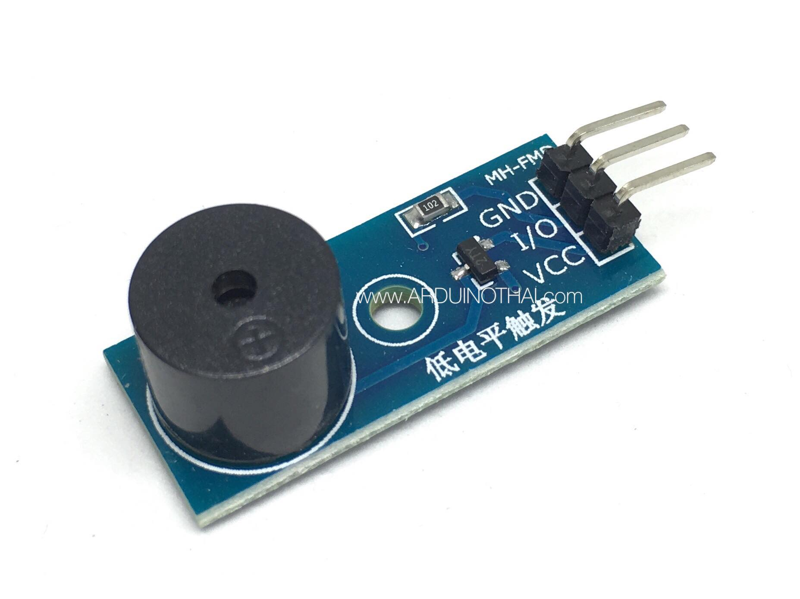

#ຕົວຢ່າງການນຳໃຊ້ 
Active Buzzer ຖືກນຳໃຊ້ໃນທຸກໂຄງການທີ່ຕ້ອງການສຽງແຈ້ງເຕືອນແບບງ່າຍດາຍ

| **ການໃຊ້ງານ**                                 | **ລາຍລະອຽດ**                                                                                                           |
| --------------------------------------------- | ---------------------------------------------------------------------------------------------------------------------- |
| **ລະບົບເຕືອນໄພ (Alarm Systems)**              | ໃຊ້ຮ່ວມກັບເຊັນເຊີຕ່າງໆ ເຊັ່ນ: ເຊັນເຊີຈັບການເຄື່ອນໄຫວ (PIR Sensor) ຫຼື ເຊັນເຊີຈັບຄວັນ ເພື່ອປ່ອຍສຽງເຕືອນໄພຢ່າງຕໍ່ເນື່ອງ. |
| **ສັນຍານຢືນຢັນ (Confirmation Beeps)**         | ສ້າງສຽງ "ຕີດ" ເມື່ອຜູ້ໃຊ້ກົດປຸ່ມ (Push Button), ສະແກນບັດ (RFID) ຫຼື ປ້ອນລະຫັດຜ່ານຖືກຕ້ອງ.                              |
| **ເຄື່ອງຈັບເວລາ (Timers)**                    | ສົ່ງສັນຍານເຕືອນເມື່ອເວລາໝົດ (ເຊັ່ນ: ເຄື່ອງຈັບເວລາໃນເຮືອນຄົວ ຫຼື ໂມງປຸກ).                                               |
| **ການແຈ້ງເຕືອນຄວາມຜິດພາດ (Error Indicators)** | ໃຊ້ໃນເຄື່ອງມື ຫຼື ຫຸ່ນຍົນ ເພື່ອສົ່ງສຽງເຕືອນເມື່ອມີຄວາມຜິດພາດໃນການເຮັດວຽກ (ເຊັ່ນ: ແບັດເຕີຣີຕ່ຳ, ອຸນຫະພູມສູງເກີນ).       |

## 14.**Passive Buzzer** 
   ແມ່ນອຸປະກອນສ້າງສຽງທີ່ **ບໍ່ມີ** ວົງຈອນສັ່ນ (Oscillator) ສ້າງມາຢູ່ໃນໂຕ. ມັນເປັນພຽງແຕ່ **Audio Transducer** (ຄືກັບລຳໂພງນ້ອຍໆ) ເຊິ່ງຕ້ອງການສັນຍານຄວາມຖີ່ທີ່ປ່ຽນແປງຕະຫຼອດເວລາຈາກພາຍນອກເພື່ອເຮັດໃຫ້ເກີດສຽງ.
- **ບໍ່ມີວົງຈອນໃນໂຕ:** ເມື່ອປ້ອນໄຟຟ້າກະແສກົງ (DC) ຄົງທີ່ເຂົ້າໄປ, ມັນຈະສ້າງພຽງສຽງ "ຄລິກ" ດຽວ (ຄືກັບສຽງສະວິດ) ແຕ່ບໍ່ສ້າງສຽງດັງຕໍ່ເນື່ອງ.
- **ສຽງປ່ຽນແປງໄດ້:** ຄວາມຖີ່ຂອງສຽງ (Tone) ແມ່ນຂຶ້ນກັບຄວາມຖີ່ຂອງສັນຍານທີ່ປ້ອນເຂົ້າໄປ, ເຮັດໃຫ້ມັນສາມາດ **ຫຼິ້ນສຽງຫຼາຍໂຕນ** ແລະ **ສ້າງສຽງເພງ** ໄດ້.
- **ຫຼັກການຄືກັບລຳໂພງ:** ມັນຕ້ອງໄດ້ຮັບສັນຍານ AC (Alternating Current) ຫຼື ສັນຍານ Pulse Width Modulation (PWM) ຈາກໄມໂຄຄອນໂທຣນເລີ ເພື່ອເຮັດໃຫ້ແຜ່ນ Piezo ພາຍໃນສັ່ນສະເທືອນ ແລະສ້າງຄື້ນສຽງອອກມາ.
#ການໃຊ້ງານຂອງອຸປະກອນ 
Passive Buzzer ແມ່ນອີງໃສ່ **ຜົນກະທົບ Piezoelectric** (ຫຼື ຫຼັກການແມ່ເຫຼັກໄຟຟ້າ) ທີ່ຖືກຄວບຄຸມດ້ວຍຄວາມຖີ່:
 1. ການສ້າງສັນຍານຄວາມຖີ່ (Frequency Generation)
- **ການຄວບຄຸມ:** ໄມໂຄຄອນໂທຣນເລີ (ເຊັ່ນ: Arduino) ຈະໃຊ້ຟັງຊັນພິເສດ ເຊັ່ນ: **`tone()`** ເພື່ອສ້າງສັນຍານ **Square Wave (ຄື້ນສີ່ຫຼ່ຽມ)** ທີ່ມີຄວາມຖີ່ສະເພາະ.
- **ຄວາມຖີ່ = ສຽງ:**
    - ຖ້າປ່ອຍສັນຍານຄວາມຖີ່ $440 \text{ Hz}$, Buzzer ຈະສ້າງສຽງ **Note A4** (ໂຕນລາ).
    - ຖ້າປ່ອຍສັນຍານຄວາມຖີ່ $523 \text{ Hz}$, Buzzer ຈະສ້າງສຽງ **Note C5** (ໂຕນໂດ).
    - ໂດຍການປ່ຽນຄວາມຖີ່ຂອງສັນຍານຢ່າງຕໍ່ເນື່ອງ, Buzzer ຈະສ້າງສຽງໂນ໊ດດົນຕີທີ່ແຕກຕ່າງກັນ.
1. ການເຮັດໃຫ້ເກີດສຽງ
2. **ປ້ອນສັນຍານ:** ສັນຍານ Square Wave ຈາກໄມໂຄຄອນໂທຣນເລີຈະຖືກປ້ອນເຂົ້າໄປໃນ Buzzer.
3. **ການສັ່ນສະເທືອນ:** ການປ່ຽນແປງຂອງແຮງດັນໄຟຟ້າ (ຈາກ $0\text{V}$ ໄປຫາ $5\text{V}$ ແລະກັບຄືນ) ເຮັດໃຫ້ແຜ່ນ Piezo ພາຍໃນສັ່ນສະເທືອນຕາມຈັງຫວະຄວາມຖີ່ຂອງສັນຍານນັ້ນ.
4. **ປ່ອຍສຽງ:** ການສັ່ນສະເທືອນຈະສ້າງຄື້ນສຽງອອກມາໃນຄວາມຖີ່ທີ່ເຮົາກຳນົດ.
> **ຄວາມແຕກຕ່າງສຳຄັນ:**
> - **Active Buzzer:** ຄວບຄຸມດ້ວຍ **HIGH/LOW** (ເປີດ/ປິດ) ເທົ່ານັ້ນ.
> - **Passive Buzzer:** ຄວບຄຸມດ້ວຍ **ຄວາມຖີ່** (ສັນຍານ $Hz$).
> - 

#ຕົວຢ່າງການນຳໃຊ້ 
Passive Buzzer ເໝາະສຳລັບໂຄງການທີ່ຕ້ອງການສຽງທີ່ຫຼາກຫຼາຍ ແລະສັບຊ້ອນກວ່າ:

| **ການໃຊ້ງານ**                         | **ລາຍລະອຽດ**                                                                                                    |
| ------------------------------------- | --------------------------------------------------------------------------------------------------------------- |
| **ການຫຼິ້ນສຽງເພງ (Playing Melodies)** | ໃຊ້ການປ່ຽນແປງຄວາມຖີ່ຂອງສັນຍານຢ່າງຕໍ່ເນື່ອງ ເພື່ອຫຼິ້ນສຽງເພງງ່າຍໆ ຫຼື ໂຕນດົນຕີ (ເຊັ່ນ: ເພງ Mario ຫຼື Star Wars). |
| **ສ້າງສຽງເອັບເຟັກ (Sound Effects)**   | ສ້າງສຽງສູງ-ຕ່ຳ, ສຽງລົດຫວໍ, ຫຼື ສຽງເອັບເຟັກເກມແບບ 8-bit ໂດຍການປ່ຽນຄວາມຖີ່ຢ່າງໄວວາ.                               |
| **ສັນຍານເຕືອນທີ່ປ່ຽນແປງໄດ້**          | ສ້າງສຽງເຕືອນທີ່ຊັບຊ້ອນກວ່າ (ເຊັ່ນ: ສຽງເຕືອນທີ່ເລັ່ງຂຶ້ນຕາມຄວາມໃກ້ຂອງວັດຖຸ) ໂດຍການປັບຄວາມຖີ່ຕາມຂໍ້ມູນຈາກເຊັນເຊີ. |
| **ການທົດແທນລຳໂພງ**                    | ໃຊ້ເປັນລຳໂພງຂະໜາດນ້ອຍສຳລັບໂປເຈັກທີ່ບໍ່ຕ້ອງການຄຸນນະພາບສຽງສູງ.                                                    |
## 15.  **16x2 LCD Display** 
  ແມ່ນໂມດູນຈໍສະແດງຜົນຊະນິດໜຶ່ງທີ່ໃຊ້ກັນຢ່າງກວ້າງຂວາງໃນໂປຣເຈັກເອເລັກໂຕຣນິກ, ໂດຍສະເພາະກັບໄມໂຄຄອນໂທຣນເລີ ເຊັ່ນ: Arduino.
- **ຊື່:** 16x2 ໝາຍເຖິງຂະໜາດການສະແດງຜົນຂອງມັນ: **16 ຕົວອັກສອນ (Characters)** ຕໍ່ **2 ແຖວ (Rows)**. ລວມທັງໝົດແລ້ວສາມາດສະແດງໄດ້ $16 \times 2 = 32$ ຕົວອັກສອນ.
- **ປະເພດ:** ມັນເປັນຈໍສະແດງຜົນແບບ **Character LCD** ເຊິ່ງຖືກອອກແບບມາເພື່ອສະແດງຕົວອັກສອນຕົວເລກ, ສັນຍາລັກ, ແລະສັນຍາລັກທີ່ກຳນົດເອງໄດ້ (custom characters).
- **ການໃຊ້ງານ:** ຖືກນຳໃຊ້ເປັນສ່ວນໃຫຍ່ເພື່ອສະແດງຂໍ້ຄວາມສັ້ນໆ, ສະຖານະ, ຄ່າການວັດແທກຈາກເຊັນເຊີ (ເຊັ່ນ: ອຸນຫະພູມ), ຫຼື ເມນູງ່າຍໆ.
#ການໃຊ້ງານຂອງອຸປະກອນ 
16x2 LCD ສ່ວນຫຼາຍໃຊ້ Controller ຊື່ວ່າ **Hitachi HD44780** (ຫຼື ໂຕທີ່ທຽບເທົ່າ) ເພື່ອຄວບຄຸມການສະແດງຜົນ.
🔸  ຫຼັກການພື້ນຖານ: Liquid Crystal
1. **ໂຄງສ້າງ:** ຈໍສະແດງຜົນປະກອບດ້ວຍແຜ່ນ **Liquid Crystal (ຂອງແຫຼວຜລຶກ)** ທີ່ຢູ່ລະຫວ່າງແຜ່ນແກ້ວ ແລະ Polarizer.
2. **ການຄວບຄຸມແສງ:** ເມື່ອມີກະແສໄຟຟ້າຖືກປ້ອນເຂົ້າໄປໃນພິກເຊວ (Pixel) ໃດໜຶ່ງ, ຂອງແຫຼວຜລຶກຈະປ່ຽນທິດທາງ, ເຊິ່ງຈະ **ບລັອກ ຫຼື ຍອມໃຫ້ແສງ Backlight** (ແສງດ້ານຫຼັງ) ສ່ອງຜ່ານອອກມາ, ເຮັດໃຫ້ເກີດຈຸດດຳຂຶ້ນມາ.
3. **ສ້າງຕົວອັກສອນ:** ຕົວອັກສອນແຕ່ລະຕົວແມ່ນປະກອບດ້ວຍເມທຣິກພິກເຊວຂະໜາດ **$5 \times 8$ ຈຸດ** ເຊິ່ງ Controller ຈະຄວບຄຸມວ່າຈະເປີດປິດພິກເຊວໃດເພື່ອສ້າງເປັນຮູບຕົວອັກສອນ.
🔹  ການສົ່ງຂໍ້ມູນ (Commands and Data)
ໄມໂຄຄອນໂທຣນເລີຈະຕິດຕໍ່ສື່ສານກັບ LCD ໂດຍການສົ່ງ:
- **ຄຳສັ່ງ (Commands):** ແມ່ນຄຳສັ່ງທີ່ບອກໃຫ້ LCD ເຮັດວຽກສະເພາະເຈາະຈົງ ເຊັ່ນ:
    - ລຶບລ້າງໜ້າຈໍ (Clear Display).
    - ຍ້າຍ Cursor ໄປຕຳແໜ່ງໃດໜຶ່ງ.
    - ຕັ້ງຄ່າການເຮັດວຽກ (4-bit ຫຼື 8-bit mode).
- **ຂໍ້ມູນ (Data):** ແມ່ນຕົວອັກສອນຕົວຈິງທີ່ຕ້ອງການໃຫ້ສະແດງຜົນເທິງໜ້າຈໍ.

#ຕົວຢ່າງການນຳໃຊ້ 
    LCD 16x2 ມັກຈະມີ 16 ປລັກສຽບ, ແຕ່ເມື່ອໃຊ້ໂມດູນ I²C ເພີ່ມ (ເຊິ່ງເປັນທີ່ນິຍົມ) ມັນຈະຫຼຸດລົງເຫຼືອພຽງ 4 ປລັກສຽບ

| **ປລັກສຽບ (Pin)** | **ຊື່**                  | **ໜ້າທີ່**                                                                                                       |
| ----------------- | ------------------------ | ---------------------------------------------------------------------------------------------------------------- |
| 1                 | **VSS**                  | ຕໍ່ເຂົ້າກັບ **GND (ພື້ນ)**.                                                                                      |
| 2                 | **VCC**                  | ຕໍ່ເຂົ້າກັບ **ໄຟ $5\text{V}$**.                                                                                  |
| 3                 | **V0** (VEE)             | ປັບ **Contrast (ຄວາມຄົມຊັດ)** ຂອງຈໍສະແດງຜົນ, ໂດຍທົ່ວໄປເຊື່ອມຕໍ່ກັບ **Potentiometer**.                            |
| 4                 | **RS** (Register Select) | ກຳນົດວ່າຂໍ້ມູນທີ່ສົ່ງແມ່ນ: **ຄຳສັ່ງ ($0$)** ຫຼື **ຂໍ້ມູນຕົວອັກສອນ ($1$)**.                                       |
| 5                 | **R/W** (Read/Write)     | ກຳນົດ: **ຂຽນ ($0$)** ຂໍ້ມູນໄປຫາ LCD ຫຼື **ອ່ານ ($1$)** ຂໍ້ມູນຈາກ LCD. (ໂດຍທົ່ວໄປຕໍ່ກັບ GND ເພື່ອຂຽນຢ່າງດຽວ).     |
| 6                 | **E** (Enable)           | ເປັນປລັກສຽບທີ່ໃຊ້ໃນການ **ລັອກ (Latch)** ຂໍ້ມູນ/ຄຳສັ່ງ. ຕ້ອງມີການປ່ຽນຈາກ HIGH ໄປຫາ LOW ເພື່ອໃຫ້ LCD ຮັບຮູ້ຂໍ້ມູນ. |
| 7-14              | **D0 - D7** (Data Pins)  | ສົ່ງຂໍ້ມູນ ຫຼື ຄຳສັ່ງ (ໃຊ້ແບບ 8-bit ຫຼື 4-bit).                                                                  |
| 15                | **LED+** (A)             | ໄຟບວກຂອງ Backlight (ເຊື່ອມຕໍ່ຜ່ານ Resistor).                                                                     |
| 16                | **LED-** (K)             | ໄຟລົບຂອງ Backlight (ຕໍ່ກັບ GND).                                                                                 |
## 16. I2C Serial Adapter board module
ແມ່ນແຜງວົງຈອນຂະໜາດນ້ອຍທີ່ຖືກອອກແບບມາເພື່ອເປັນ **ຕົວແປງ** ການສື່ສານລະຫວ່າງໄມໂຄຄອນໂທຣນເລີ (ເຊັ່ນ: Arduino ຫຼື Raspberry Pi) ກັບຈໍສະແດງຜົນຕົວອັກສອນ LCD (ເຊັ່ນ: LCD 16x2 ຫຼື 20x4).
#ການໃຊ້ງານຂອງອຸປະກອນ 
ໜ້າທີ່ຫຼັກຂອງມັນແມ່ນການ **ຫຼຸດຈຳນວນສາຍໄຟ** ທີ່ຕ້ອງໃຊ້ໃນການເຊື່ອມຕໍ່ຈໍ LCD.
- **ແບບທຳມະດາ:** ການເຊື່ອມຕໍ່ຈໍ LCD ມາດຕະຖານ (4-bit mode) ຕ້ອງການຢ່າງໜ້ອຍ **7 ຫາ 12 ຂາ I/O** ຂອງໄມໂຄຄອນໂທຣນເລີ.
- **ແບບໃຊ້ I²C Adapter:** ຕ້ອງການພຽງແຕ່ **4 ສາຍ** ເທົ່ານັ້ນ:
    1. **VCC** (ໄຟລ້ຽງ)
    2. **GND** (ສາຍດິນ)
    3. **SDA** (Serial Data Line - ສາຍຂໍ້ມູນ)
    4. **SCL** (Serial Clock Line - ສາຍໂມງ)
ການເຮັດແບບນີ້ຈະຊ່ວຍໃຫ້ທ່ານ **ປະຢັດຂາ I/O** ຂອງໄມໂຄຄອນໂທຣນເລີໄວ້ໃຊ້ກັບເຊັນເຊີ ຫຼື ສ່ວນປະກອບອື່ນໆໃນໂປຣເຈັກຂອງທ່ານໄດ້.
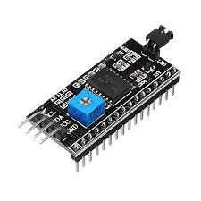

#ຕົວຢ່າງການນຳໃຊ້ 
###### ⚙️ ການເຊື່ອມຕໍ່ອຸປະກອນ (Hardware Connection)

|**Pin ໃນ Module**|**ເຊື່ອມຕໍ່ກັບ**|**ໝາຍເຫດ**|
|---|---|---|
|**VCC**|**$5\text{V}$** (ຂອງ Arduino)|ໄຟລ້ຽງໂມດູນແລະຈໍ LCD|
|**GND**|**GND** (ຂອງ Arduino)|ສາຍດິນ|
|**SDA**|**A4** (ຂອງ Arduino Uno)|ສາຍຂໍ້ມູນ I²C|
|**SCL**|**A5** (ຂອງ Arduino Uno)|ສາຍໂມງ I²C|

- _ໝາຍເຫດ:_ ກ່ອນອື່ນ, ຕ້ອງໄດ້ບັດກີ (Solder) ໂມດູນ I²C ເຂົ້າກັບດ້ານຫຼັງຂອງຈໍ LCD ໃຫ້ຮຽບຮ້ອຍ.
###### 🧰 ການປັບແຕ່ງ (Configuration)
ທ່ານຈະຕ້ອງປັບຄ່າສອງຢ່າງກ່ອນການໃຊ້ງານ:
- **ປັບ Contrast:** ໃຊ້ໄຂຄວງນ້ອຍໆໝູນ **Potentiometer (ຕົວຕ້ານທານທີ່ປັບໄດ້)** ສີຟ້າ/ສີດຳ ທີ່ຢູ່ເທິງໂມດູນ. ໃຫ້ໝູນຈົນກວ່າທ່ານຈະເຫັນຕົວອັກສອນປະກົດຂຶ້ນຢ່າງຊັດເຈນ (ບາງຄັ້ງຕ້ອງລໍຖ້າການອັບໂຫຼດໂຄດກ່ອນ).
- **ກວດສອບ I²C Address:** ໂມດູນ I²C ແຕ່ລະອັນມີທີ່ຢູ່ (Address) ສະເພາະຕົວ, ໂດຍສ່ວນຫຼາຍຈະເປັນ **$0\text{x}27$** ຫຼື **$0\text{x}3F$**. ຖ້າຫາກໃຊ້ທີ່ຢູ່ເລີ່ມຕົ້ນແລ້ວບໍ່ເຮັດວຽກ, ທ່ານຕ້ອງໃຊ້ໂຄດ **I²C Scanner** ເພື່ອສະແກນຫາທີ່ຢູ່ທີ່ຖືກຕ້ອງກ່ອນນຳໄປໃຊ້ໃນໂຄດຕົວຈິງ.
## 17.  7-segment display (Common Cathode +)
 ແມ່ນຈໍສະແດງຜົນເອເລັກໂຕຣນິກທີ່ໃຊ້ໄຟ LED 7 ໂຕ (ຫຼື "segments") ມາປະກອບກັນເປັນຮູບເລກ 8 ເພື່ອສະແດງຕົວເລກ (0-9) ແລະ ຕົວອັກສອນບາງໂຕ.
ແບບ **Common Cathode** ແມ່ນຮູບແບບການເຊື່ອມຕໍ່ພາຍໃນຂອງໄຟ LEDເຫຼົ່ານີ້:
#🔸  ຫຼັກການເຮັດວຽກຂອງ Common Cathode
ຄໍາວ່າ **"Common Cathode"** ໝາຍຄວາມວ່າ:
- **ຂາ Cathode (ຂາກັບ) ທັງໝົດ** ຂອງໄຟ LED ທັງ 7 segments (A, B, C, D, E, F, G) ແລະ ຈຸດທົດສະນິຍົມ (DP) ຖືກເຊື່ອມຕໍ່ເຂົ້າກັນໝົດ.
- ຂາລວມ (Common Pin) ນີ້ຈະຖືກຕໍ່ເຂົ້າກັບ **ສາຍດິນ (GND)** ຫຼື **Logic LOW** ຂອງວົງຈອນ.
- **ການເປີດໄຟ (ON):** ເພື່ອໃຫ້ segment ໃດນຶ່ງສະຫວ່າງຂຶ້ນ, ທ່ານຈະຕ້ອງປ້ອນສັນຍານ **Logic HIGH** (ເຊັ່ນ: $5\text{V}$) ເຂົ້າໄປທີ່ຂາ **Anode (ຂາເຂົ້າ)** ຂອງ segment ນັ້ນ.
#🔹  ສະຫຼຸບຄວາມແຕກຕ່າງ

|**ຄຸນລັກສະນະ**|**Common Cathode**|**Common Anode**|
|---|---|---|
|**ຂາລວມ (COM)**|ຕ້ອງຕໍ່ກັບ **GND (0V)**|ຕ້ອງຕໍ່ກັບ **VCC (+5V)**|
|**ເປີດ Segment**|ປ້ອນ **Logic HIGH ($1$)**|ປ້ອນ **Logic LOW ($0$)**|

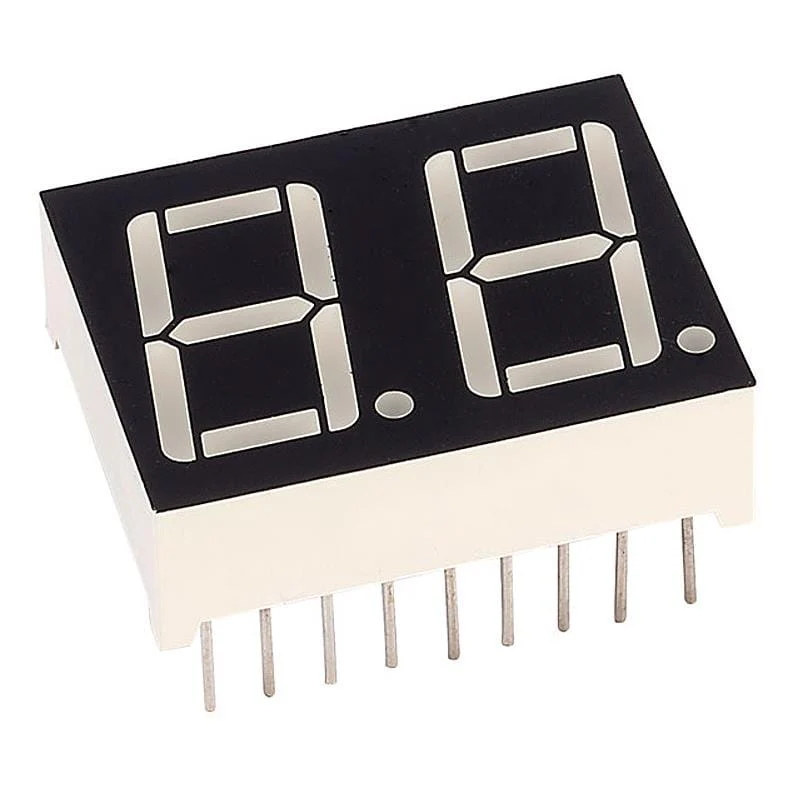
#ຕົວຢ່າງການນຳໃຊ້ 
#⚙️ 1. ການເຊື່ອມຕໍ່ວົງຈອນ (Circuit Connection)
**ສິ່ງທີ່ຕ້ອງການ:**
- 7-Segment Display (Common Cathode) $1$ ໂຕ
- Arduino Uno $1$ ບອດ
- ຕົວຕ້ານທານ (Resistors) $220\text{ Ohm}$ $7$ ໂຕ (ສຳຄັນເພື່ອປ້ອງກັນ LED)
- ສາຍໄຟເຊື່ອມຕໍ່ (Jumper Wires)
- Breadboard
#📌 ວິທີເຊື່ອມຕໍ່
1. **Common Pin:** ເຊື່ອມຕໍ່ຂາ **COM** (ຂາທົ່ວໄປ, ປົກກະຕິແມ່ນຂາ $3$ ແລະ $8$) ຂອງ 7-Segment ເຂົ້າກັບຂາ **GND** ຂອງ Arduino.
2. **Segment Pins:** ເຊື່ອມຕໍ່ຂາ segment $A$ ຫາ $G$ ແຕ່ລະຂາຜ່ານ **ຕົວຕ້ານທານ $220\text{ Ohm}$** ກ່ອນເຂົ້າກັບຂາດິຈິຕອລ (Digital Pins) ຂອງ Arduino ດັ່ງລຸ່ມນີ້:

|**Segment**|**7-Segment Pin**|**ຕົວຕ້ານທານ 220 Ohm**|**ຕໍ່ເຂົ້າກັບ Arduino Pin**|
|---|---|---|---|
|**A**|$7$|$\rightarrow$|$7$|
|**B**|$6$|$\rightarrow$|$6$|
|**C**|$4$|$\rightarrow$|$5$|
|**D**|$2$|$\rightarrow$|$4$|
|**E**|$1$|$\rightarrow$|$3$|
|**F**|$9$|$\rightarrow$|$8$|
|**G**|$10$|$\rightarrow$|$9$|
## 18.  4-Digit 7-Segment Display

ແມ່ນຈໍສະແດງຜົນເອເລັກໂຕຣນິກທີ່ລວມເອົາຈໍ 7-Segment ຈຳນວນ 4 ໂຕ ມາໄວ້ໃນໂມດູນດຽວກັນ ເພື່ອສະແດງຕົວເລກສີ່ຫຼັກ (ເຊັ່ນ: $1234$ ຫຼື ເວລາ $10:30$).
ຈໍປະເພດນີ້ແມ່ນຖືກນິຍົມໃຊ້ຢ່າງກວ້າງຂວາງໃນໂມງດິຈິຕອລ, ເຄື່ອງນັບ (Counters), ເຄື່ອງວັດແທກ (Meters), ແລະ ເຄື່ອງຄິດໄລ່ພື້ນຖານ.
⚙️  ຫຼັການເຮັດວຽກທີ່ສຳຄັນ: Multiplexing (ການສະຫຼັບ)
ສິ່ງທີ່ເຮັດໃຫ້ 4-Digit 7-Segment ແຕກຕ່າງຈາກຈໍຫຼັກດຽວແມ່ນວິທີການຄວບຄຸມມັນ.
- **ບັນຫາການໃຊ້ Pin ຫຼາຍ:** ຖ້າເຮົາຄວບຄຸມຈໍ 4 ຫຼັກແບບທຳມະດາ, ມັນຈະຕ້ອງໃຊ້ສາຍໄຟເຖິງ $4 \text{ ຫຼັກ} \times 7 \text{ segments} = 28$ ຂາ!
- **ການແກ້ໄຂດ້ວຍ Multiplexing:** ເພື່ອປະຢັດຈຳນວນຂາຂອງໄມໂຄຄອນໂທຣນເລີ (ເຊັ່ນ: Arduino), ຜູ້ຜະລິດຈຶ່ງເຊື່ອມຕໍ່:
    1. **Segements ທັງໝົດແມ່ນໃຊ້ຂາຮ່ວມກັນ:** ຂາ segment $A$ ຂອງທັງສີ່ຫຼັກແມ່ນເຊື່ອມຕໍ່ກັນ, segment $B$ ແມ່ນເຊື່ອມຕໍ່ກັນ, ແລະອື່ນໆ. (ລວມທັງໝົດພຽງ 7-8 ຂາສຳລັບ segments).
    2. **ແຕ່ລະຫຼັກມີຂາຄວບຄຸມສະເພາະ (Digit Select/Common Pin):** ແຕ່ລະຫຼັກມີຂາ **Common** ຂອງຕົນເອງ (ເຊັ່ນ: **D1, D2, D3, D4**) ເພື່ອໃຊ້ໃນການເປີດ-ປິດ ຫຼັກນັ້ນໆ.
⚡ ວິທີການສະຫຼັບ (Multiplexing)
ໄມໂຄຄອນໂທຣນເລີຈະໃຊ້ເຕັກນິກທີ່ເອີ້ນວ່າ **Time-Multiplexing** ໂດຍການສະແດງຕົວເລກແຕ່ລະຫຼັກຕາມລໍາດັບຢ່າງວ່ອງໄວ:
1. **ສະແດງຫຼັກ $1$:** ເປີດຫຼັກ $1$ (ເປີດຂາ $D1$) ພ້ອມທັງສົ່ງສັນຍານ segments ທີ່ຕ້ອງການສະແດງຕົວເລກຂອງຫຼັກ $1$.
2. **ປິດທັງໝົດ:** ປິດຫຼັກ $1$.
3. **ສະແດງຫຼັກ $2$:** ເປີດຫຼັກ $2$ (ເປີດຂາ $D2$) ພ້ອມທັງສົ່ງສັນຍານ segments ທີ່ຕ້ອງການສະແດງຕົວເລກຂອງຫຼັກ $2$.
4. ເຮັດແບບດຽວກັນໄປຈົນເຖິງຫຼັກ $4$, ແລະກັບຄືນໄປຫຼັກ $1$ ໃໝ່.

ເມື່ອການສະຫຼັບນີ້ເກີດຂຶ້ນໄວພໍ (ປົກກະຕິໄວກວ່າ $100$ ເທື່ອຕໍ່ວິນາທີ), ຕາຂອງຄົນເຮົາຈະຮັບຮູ້ວ່າທັງ $4$ ຫຼັກແມ່ນຕິດພ້ອມກັນຕະຫຼອດເວລາ (ເອີ້ນວ່າ: **Persistence of Vision**).

#ຕົວຢ່າງການນຳໃຊ້ 
#🧰 1. ການຕິດຕັ້ງ Library
1. ເປີດ **Arduino IDE**.
2. ໄປທີ່ **Sketch > Include Library > Manage Libraries...**.
3. ໃນຊ່ອງຄົ້ນຫາ, ພິມ: **`SevSeg`**.
4. ຕິດຕັ້ງ Library ທີ່ຊື່ວ່າ **`SevSeg`** ໂດຍ **Dean Reading**.
#🔌 ການເຊື່ອມຕໍ່ຮາດແວ (Hardware Connection)
ການເຊື່ອມຕໍ່ 4-Digit 7-Segment (Common Cathode) ຕ້ອງໃຊ້ທັງໝົດ 12 ພິນ (8 segments + 4 digits), ດັ່ງນັ້ນ, ທ່ານອາດຈະຕ້ອງໃຊ້ຂາ Digital ຫຼາຍຂາ.

|**7-Segment Pin**|**ໜ້າທີ່**|**ເຊື່ອມຕໍ່ກັບ Arduino Pin**|
|---|---|---|
|**A, B, C, D, E, F, G, DP**|Segment Pins|**Digital Pins: 2, 3, 4, 5, 6, 7, 8, 9** (ຕາມລຳດັບ)|
|**D1 (ຫຼັກ 1)**|Digit Pin|**Digital Pin: 10**|
|**D2 (ຫຼັກ 2)**|Digit Pin|**Digital Pin: 11**|
|**D3 (ຫຼັກ 3)**|Digit Pin|**Digital Pin: 12**|
|**D4 (ຫຼັກ 4)**|Digit Pin|**Digital Pin: 13**|

> ⚠️ **ໝາຍເຫດ:**
> - **ຕົວຕ້ານທານ:** ຕ້ອງມີ **ຕົວຕ້ານທານ (Resistor) ປະມານ $220\text{ Ohm}$** ຕໍ່ແບບອະນຸກົມ (Series) ໃນແຕ່ລະຂາ **Segment (A-G)** ເພື່ອປ້ອງກັນ LED.
> - **Common Cathode:** ຈົ່ງຈື່ໄວ້ວ່າ: **Digit Pin** ຕ້ອງປ້ອນ **LOW** ເພື່ອເປີດຫຼັກໃດນຶ່ງ.
## 19. 8x8 Dot Matrix display
>ແມ່ນອຸປະກອນສະແດງຜົນປະເພດໜຶ່ງ ທີ່ປະກອບດ້ວຍຫຼອ LED ນ້ອຍໆ **64 ດວງ** (ຈັດເປັນ **8 ແຖວ × 8 ຖັນ**) ໃຊ້ສຳລັບສະແດງ **ຕົວອັກສອນ, ຕົວເລກ, ຮູບສັນຍາລັກ ຫຼື ຮູບພາບງ່າຍໆ**.
> #ການໃຊ້ງານຂອງອຸປະກອນ 
>    - ແຕ່ລະ LED ຢູ່ຈຸດຕັດລະຫວ່າງ **ແຖວ (Row)** ແລະ **ຖັນ (Column)**
- ເມື່ອສົ່ງໄຟໄປທີ່ແຖວ ແລະ ຖັນໃດໜຶ່ງ, LED ທີ່ຢູ່ຈຸດນັ້ນຈະຕິດ
- ລະບົບຈະເປີດ–ປິດໄຟໄວໆ (ເອີ້ນວ່າ **Multiplexing**) ເພື່ອໃຫ້ເຫັນເປັນຮູບພາບຕໍ່ເນື່ອງ
 ⚙️ **ລັກສະນະທົ່ວໄປ**
- ມີ **16 pin** (8 ສຳລັບແຖວ, 8 ສຳລັບຖັນ)
- ມີສອງປະເພດ:
    - **Common Anode** – ຂົວບວກຂອງແຖວຖືກເຊື່ອມກັນ
    - **Common Cathode** – ຂົວລົບຂອງແຖວຖືກເຊື່ອມກັນ
🔧 **ໃຊ້ຮ່ວມກັບອະໄຫຼ່ອື່ນໆໄດ້**
- ບໍ່ສາມາດຄວບຄຸມດ້ວຍມືໂດຍກົງ, ຈຳເປັນຕ້ອງໃຊ້ບອດເຊັ່ນ:
    - **Arduino Uno**
    - **MAX7219 IC** (ຊ່ວຍໃຫ້ຄວບຄຸມງ່າຍຂຶ້ນ)
    - **Raspberry Pi**
    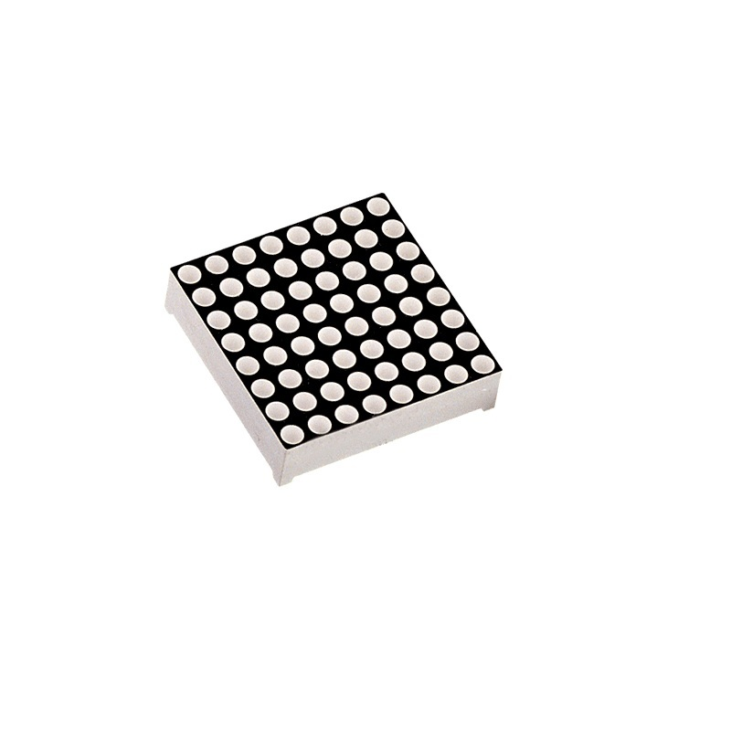
    ## 20.Temperature and humidity sensor (DHT11)
     **DHT11** ແມ່ນເຊັນເຊີ (Sensor) ທີ່ໃຊ້ວັດ **ອຸນຫະພູມ (Temperature)** ແລະ **ຄວາມຊຸ່ມ (Humidity)** ຈາກສະພາບອາກາດຮອບໆ.  
        ມັນເປັນອຸປະກອນທີ່ນິຍົມໃຊ້ກັບ **Arduino**, **Raspberry Pi**, ແລະໂຄງການ IoT ຕ່າງໆ.
#ການໃຊ້ງານຂອງອຸປະກອນ 
        ⚙️ **ລັກສະນະທົ່ວໄປ (Specifications)**

|ລາຍການ|ລາຍລະອຽດ|
|---|---|
|🔹 ຊ່ວງວັດອຸນຫະພູມ|0°C – 50°C|
|🔹 ຄວາມຄວາມຖືກຕ້ອງອຸນຫະພູມ|±2°C|
|🔹 ຊ່ວງວັດຄວາມຊຸ່ມ|20% – 90% RH|
|🔹 ຄວາມຖືກຕ້ອງຄວາມຊຸ່ມ|±5% RH|
|🔹 ແຮງດັນໄຟຟ້າທີ່ໃຊ້|3V – 5.5V DC|
|🔹 ຈຳນວນຂາ|3 ຫຼື 4 (ແລ້ວແຕ່ຮຸ່ນ)|
 🧩 **ຂາຂອງ DHT11 (Pinout)**
ຖ້າເປັນຮຸ່ນ 4 ຂາ (ທີ່ນິຍົມໃຊ້ກັບ Arduino):
1. **VCC** – ຈ່າຍໄຟ (+5V)
2. **DATA** – ຂາສົ່ງຂໍ້ມູນດິຈິຕອນ
3. **NC** – ບໍ່ໄດ້ໃຊ້ (ບາງຮຸ່ນບໍ່ມີ)
4. **GND** – ຕໍ່ດິນ (Ground)
💡 **ຫຼັກການເຮັດວຽກ**
- DHT11 ມີສອງສ່ວນຫຼັກ:
    1. **ຕົວວັດຄວາມຊຸ່ມ** ໃຊ້ແຜ່ນຊຸບເຊັບຄວາມຊຸ່ມໃນອາກາດ
    2. **ຕົວວັດອຸນຫະພູມ** ໃຊ້ອົງປະກອນ NTC (Thermistor)
- ສົ່ງຄ່າທີ່ວັດໄດ້ອອກເປັນ **ຂໍ້ມູນດິຈິຕອນ (Digital Signal)** ໃຫ້ບອດຄວບຄຸມອ່ານ.

#ຕົວຢ່າງການນຳໃຊ້ 
**1. ໂຄງການວັດອຸນຫະພູມແລະຄວາມຊຸ່ມດ້ວຍ Arduino**
🧰 ອຸປະກອນທີ່ໃຊ້:
- Arduino Uno
- DHT11 Sensor
- ສາຍ Jumper
- ຈໍ LCD (ຖ້າຕ້ອງການສະແດງຜົນ)
 🔌 ການເຊື່ອມຕໍ່:

|DHT11|Arduino|
|---|---|
|VCC|5V|
|DATA|Pin 2|
|GND|GND|
**2. ໂຄງການ “ຕື່ນເຕັ້ນຄວາມຮ້ອນ”**
ເມື່ອອຸນຫະພູມສູງເກີນ 30°C → ໃຫ້ **LED ຕິດ** ເພື່ອແຈ້ງເຕືອນ
#ຕໍ່ເພີ່ມ:

|ອຸປະກອນ|ຂາທີ່ໃຊ້|
|---|---|
|LED|Pin 13|
- ວັດອາກາດໃນຫ້ອງຮຽນ / ໂຮງງານ
- ລະບົບຄວບຄຸມອຸນຫະພູມຂອງພັກອາໄສ
- ລະບົບລ້ຽງສັດ (ຄວບຄຸມອຸນຫະພູມໃນກອງໄກ່, ຕູ້ປາ)
- ໂຄງການ IoT ເພື່ອສົ່ງຄ່າຂຶ້ນເນັດ
## 21. LM35 Temperature Sensor
ແມ່ນອຸປະກອນອິເລັກໂຕຣນິກທີ່ໃຊ້ເພື່ອວັດອຸນຫະພູມໄດ້ຢ່າງແມ່ນຍຳ ແລະສາມາດໃຊ້ງານຮ່ວມກັບ **Arduino, Raspberry Pi ຫຼືວົງຈອນອື່ນໆ** ໄດ້ງ່າຍ.
#ການໃຊ້ງານຂອງອຸປະກອນ 
 **1. ລັກສະນະທົ່ວໄປ**
- ວັດອຸນຫະພູມໄດ້ໃນຊ່ວງ **-55°C ຫາ +150°C**
- ສົ່ງສັນຍານອອກເປັນ **ແຮງດັນໄຟຟ້າ (Analog Voltage)
- ຄ່າອອກຈາກເຊັນເຊີຈະເພີ່ມຂຶ້ນ **10 mV ຕໍ່ອຸນຫະພູມ 1°C**
 **2. ຫຼັກການເຮັດວຽກ**
1. LM35 ຈະຮັບຮູ້ຄ່າອຸນຫະພູມຈາກສະພາບແວດລ້ອມ.
2. ຈາກນັ້ນຈະປ່ຽນຄ່າອຸນຫະພູມໃຫ້ເປັນ **ແຮງດັນອອກ (Output Voltage)**.
3. ສາມາດອ່ານຄ່ານີ້ຜ່ານ **Analog Input** ຂອງ Arduino ໄດ້.
3.**. ຈຸດເດັ່ນ**
✅ ວັດຄ່າໄດ້ແມ່ນຍຳ  
✅ ໃຊ້ງານງ່າຍ  
✅ ບໍ່ຈຳເປັນຕ້ອງປັບຄ່າໃຫ້ຍຸ່ງຍາກ  
✅ ເໝາະສຳລັບໂຄງການ Arduino, IoT, ລະບົບຕວດອຸນຫະພູມ
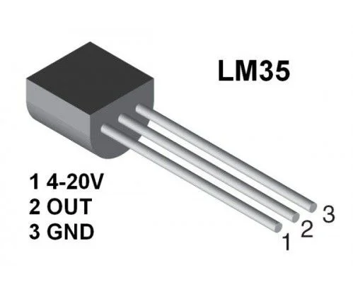
#ຕົວຢ່າງການນຳໃຊ້ 
- ຖ້າອຸນຫະພູມ = 25°C → ຄ່າອອກຈາກ LM35 ≈ **250 mV (0.25V)**
- ຖ້າອຸນຫະພູມ = 100°C → ຄ່າອອກຈາກ LM35 ≈ **1.00V**
 **3. ການເຊື່ອມຕໍ່ (Pin Configuration)**
LM35 ມີ **3 ຂາ**:

|ຂາ|ຊື່|ໜ້າທີ່|
|---|---|---|
|1|VCC|ໄຟຂ້າເຂົ້າ (4V – 20V)|
|2|VOUT|ສັນຍານອອກ (Analog Output)|
|3|GND|ຕໍ່ກັບດິນ|
## 22. Tilt sensor (x2)
  ແມ່ນອຸປະກອນອິເລັກໂຕຣນິກທີ່ໃຊ້ເພື່ອກວດຈັບການເຄື່ອນໄຫວ ຫຼື ມຸມລາດຂອງວັດຖຸ.  
ເມື່ອວັດຖຸທີ່ມັນຕິດຕັ້ງຢູ່ເອຽງ ຫຼື ຂຶ້ນໆລົງໆ, ຕົວ sensor ຈະຮູ້ສຶກໄດ້ ແລະສົ່ງສັນຍານໄຟຟ້າອອກມາ.
#ການໃຊ້ງານຂອງອຸປະກອນ 
 ### ⚙️ **1. ຫຼັກການເຮັດວຽກ**
Tilt sensor ທຳງານໂດຍອາໄສ **ການເຄື່ອນທີ່ຂອງວັດຖຸພາຍໃນ** (ເຊັ່ນ: ລູກເຫຼັກ ຫຼື ຂອງແຫຼວແລະແກັດ)  
ເມື່ອມຸມຂອງ sensor ປ່ຽນໄປ, ລູກເຫຼັກຈະເຄື່ອນໄປປິດຫຼືເປີດວົງຈອນໄຟຟ້າ
➡️ **ເມື່ອຕົວ sensor ຕັ້ງຕົງ:** ວົງຈອນຖືກຕັດ (ບໍ່ມີໄຟຜ່ານ)  
➡️ **ເມື່ອເອຽງ:** ລູກເຫຼັກເຄື່ອນໄປປິດວົງຈອນ (ໄຟຜ່ານ → ສົ່ງສັນຍານ ON)
🔩**2. ລັກສະນະທົ່ວໄປ**
- ເປັນ sensor ປະເພດ **Digital (ON/OFF)**
- ບໍ່ສາມາດວັດມຸມແບບຕໍ່ເນື່ອງໄດ້ (ເຊັ່ນ: accelerometer)
- ສາມາດຕໍ່ກັບ Arduino ຫຼືວົງຈອນອື່ນໆໄດ້ງ່າຍ
⚡ **3. ການເຊື່ອມຕໍ່ (ຕົວຢ່າງກັບ Arduino)**
ຕົວ Tilt sensor ມັກມີ **2 ຂາ**:

| ຂາ  | ໜ້າທີ່                  |
| --- | ----------------------- |
| 1   | ຕໍ່ກັບ 5V ຫຼື Input pin |
| 2   | ຕໍ່ກັບ GND              |
 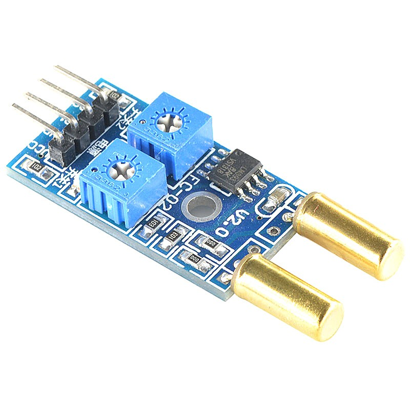.
 #ຕົວຢ່າງການນຳໃຊ້ 
 - ຕິດກັບປະຕູ ຫຼື ໜ້າຕ່າງ → ເມື່ອເປີດ ຈະແຈ້ງເຕືອນ
- ຕິດກັບຫຸ່ນຍົນ → ກວດກາວ່າໂຕຫຸ່ນລົ້ມຫຼືບໍ່
- ນຳໃຊ້ໃນອຸປະກອນປ້ອງກັນການສັ່ນ ຫຼື ລົ້ມໃນອຸດສາຫະກຳ
## 23.Photoresistor (LDRs x3)
ແມ່ນອຸປະກອນອິເລັກໂຕຣນິກຊະນິດໜຶ່ງທີ່ສາມາດປ່ຽນຄ່າຄວາມຕ້ານທານໄດ້ຕາມຄວາມເຂັ້ມຂອງແສງທີ່ມາຕົກກະທົບໃສ່ມັນ
#ການໃຊ້ງານຂອງອຸປະກອນ 
  ### ⚙️ **1. ຫຼັກການເຮັດວຽກ**
- ເມື່ອແສງຕົກກະທົບໃສ່ LDR → **ຄ່າຄວາມຕ້ານທານຈະຫຼຸດລົງ** (ກະໄຟໄຫຼ້ຜ່ານຫຼາຍ)
- ເມື່ອຢູ່ໃນທີ່ມືດ → **ຄ່າຄວາມຕ້ານທານຈະເພີ່ມຂຶ້ນ** (ກະໄຟໄຫຼ້ຜ່ານນ້ອຍ)
➡️ ດັ່ງນັ້ນ LDR ຈະປ່ຽນສັນຍານໄຟຟ້າຕາມຄວາມສວ່າງແລະຄວາມມືດ
🔩 **2. ລັກສະນະທົ່ວໄປ**

|ລາຍການ|ຄ່າ|
|---|---|
|ຈຳນວນຂາ|2|
|ປະເພດສັນຍານ|Analog|
|ຊ່ວງຄວາມຕ້ານທານ|~1 MΩ (ໃນທີ່ມືດ) ຫາ ~10 kΩ (ໃນແສງແຮງ)|
|ວັດຖຸຜະລິດ|Cadmium Sulfide (CdS)|
⚡ **3. ການເຊື່ອມຕໍ່ (ກັບ Arduino)**
ມັກໃຊ້ຮ່ວມກັບ **Resistor 10kΩ** ເພື່ອສ້າງວົງຈອນແບ່ງແຮງດັນ (Voltage Divider):
📘 **ການເຊື່ອມຕໍ່:**
- ຂາ 1 ຂອງ LDR → 5V
- ຂາ 2 ຂອງ LDR → ຂາ Analog (A0) ແລະ Resistor 10kΩ
- ອີກປາຍຂອງ Resistor → GND
🧠 **4. ຈຸດເດັ່ນ**
✅ ລາຄາຖືກ ແລະ ໃຊ້ງານງ່າຍ  
✅ ສາມາດໃຊ້ກັບວົງຈອນອະດີດໄດ້ດີ  
✅ ເໝາະສຳລັບໂຄງການກວດແສງ, ຄວບຄຸມໄຟອັດຕະໂນມັດ

#ຕົວຢ່າງການນຳໃຊ້ 
🔹 **1. ໄຟຖະໜົນອັດຕະໂນມັດ**
ເມື່ອກາງຄືນ (ແສງນ້ອຍ) → LDR ສົ່ງຄ່າຄວາມຕ້ານສູງ → ວົງຈອນສັ່ງໃຫ້ເປີດໄຟ  
ເມື່ອກາງວັນ (ແສງຫຼາຍ) → ຄ່າຄວາມຕ້ານຕ່ຳ → ວົງຈອນປິດໄຟ  
➡️ ໃຊ້ໃນລະບົບໄຟຖະໜົນ ຫຼື ໄຟສວນ
🔹 **2. ລະບົບໄຟໃນບ້ານອັດຕະໂນມັດ**
	ເມື່ອເຮືອນມືດ → ຈະເປີດໄຟພາຍໃນອັດຕະໂນມັດ  
ເມື່ອມີແສງສະຫວ່າງ → ປິດໄຟເພື່ອປະຫຍັດໄຟຟ້າ
🔹 **3. ລະບົບກວດຈັບແສງໃນຫຸ່ນຍົນ**
	ຫຸ່ນຍົນບາງປະເພດໃຊ້ LDR ເພື່ອກວດທິດທາງຂອງແສງ  
➡️ ສາມາດເຮັດໃຫ້ຫຸ່ນຍົນເຄື່ອນຕາມແສງຕາເວັນ
🔹 **4. ລະບົບຄວບຄຸມຄວາມສວ່າງໜ້າຈໍ**
	ໃນມືຖື ຫຼື ຄອມພິວເຕີ ໃຊ້ LDR ຫຼື Light Sensor ເພື່ອປັບຄວາມສວ່າງຂອງໜ້າຈໍອັດຕະໂນມັດ  
➡️ ຊ່ວຍປະຫຍັດແບດເຕີຣີ້ ແລະ ຖະນອມສາຍຕາ
🔹 **5. ລະບົບປຸກຫຼືແຈ້ງເຕືອນ**
	ເມື່ອມີແສງສະຫວ່າງສ່ອງຜ່ານ (ເຊັ່ນ ມີຄົນເປີດປະຕູ)  
→ LDR ຈະກວດພົບການປ່ຽນແປງແສງ ແລະ ສັ່ງໃຫ້ລະບົບແຈ້ງເຕືອນ
 🔹 **6. ໂຄງການຝຶກຮຽນ Arduino**
	ນັກຮຽນຫຼາຍຄົນໃຊ້ LDR ໃນການຝຶກຮຽນໂປຣແກຣມຄວບຄຸມໄຟຕາມຄວາມສວ່າງ  
ເຊັ່ນ:
- ໄຟຕິດເມື່ອມືດ
- ໄຟດັບເມື່ອມີແສງ
## 24.PIR sensor
ແມ່ນອຸປະກອນທີ່ໃຊ້ເພື່ອກວດຈັບການເຄື່ອນໄຫວຂອງມະນຸດ ຫຼື ສັດ ໂດຍອີງຈາກຄວາມຮ້ອນຫຼືລັງສີອິນຟາເຣດ (Infrared Radiation) ທີ່ຮ່າງກາຍປ່ອຍອອກ.
#ການໃຊ້ງານຂອງອຸປະກອນ 
 🔹 **ຫຼັກການເຮັດວຽກ**
1. ຕົວ sensor ມີສ່ວນກວດຈັບອິນຟາເຣດ 2 ພື້ນທີ່
2. ເມື່ອບໍ່ມີການເຄື່ອນໄຫວ → ຄ່າອິນຟາເຣດທັງສອງດ້ານຈະຄົງທີ່
3. ເມື່ອມີຄົນຫຼືສັດເຄື່ອນເຂົ້າມາ → ຄ່າຄວາມຮ້ອນຈະແຕກຕ່າງກັນ → sensor ສົ່ງສັນຍານອອກ (HIGH signal)

#ຕົວຢ່າງການນຳໃຊ້  
4. **ໄຟສ່ອງສວ່າງອັດຕະໂນມັດ** 💡
    - ເມື່ອມີຄົນເດີນຜ່ານ → ໄຟເປີດ
    - ເມື່ອບໍ່ມີການເຄື່ອນໄຫວ → ໄຟດັບ
5. **ລະບົບກັນຂໂຈນ / ປຸກເຕືອນ** 🚨
    - ຕິດຕັ້ງໃນປະຕູ ຫຼື ຫ້ອງ
    - ເມື່ອມີຄົນເຂົ້າມາບໍ່ອະນຸຍາດ → ສັ່ງໃຫ້ເສີຍສຽງປຸກ ຫຼື ແຈ້ງເຕືອນ
6. **ລະບົບປະຫຍັດພະລັງງານ** ⚡
    - ປິດໄຟ ຫຼື ອຸປະກອນເມື່ອບໍ່ມີຄົນຢູ່
7. **ໂຄງການຫຸ່ນຍົນ Arduino / Raspberry Pi** 🤖
    - ໃຊ້ກວດຈັບຄົນເຂົ້າມາ
    - ຮ່ວມກັບກ້ອງ ເພື່ອຖ່າຍຮູບເມື່ອມີການເຄື່ອນໄຫວ
🔹 **ຈຸດເດ່ນ**
- ໃຊ້ພະລັງງານນ້ອຍ
- ບໍ່ຕ້ອງສົ່ງຄືນສັນຍານ (Passive)
- ກວດຈັບໄດ້ໄກ (ປະມານ 3–7 ແມັດ)
- ທຳງານໃນມຸມກວ້າງ (ປະມານ 110–120 ອົງສາ)
## 25. Ultrasonic module
  ແມ່ນອຸປະກອນອິເລັກໂຕຣນິກທີ່ໃຊ້ຄືນສຽງຄວາມຖີ່ສູງ (Ultrasonic sound waves) ເພື່ອວັດລະຍະທາງ ຫຼື ກວດຈັບວັດຖຸຢູ່ຂ້າງໜ້າ.  
ສ່ວນໃຫຍ່ໃນວົງການ Arduino ຫຼື Robotics ຈະໃຊ້ໂມດູນ **HC-SR04** ເປັນຫຼັກ.
#ການໃຊ້ງານຂອງອຸປະກອນ 
🔸**ສ່ວນປະກອບຂອງ Ultrasonic Module**
1. **Trigger pin (TRIG)** – ສົ່ງສັນຍານສຽງອອກໄປ
2. **Echo pin (ECHO)** – ຮັບສັນຍານສຽງທີ່ສະທ້ອນກັບຄືນມາ
3. **VCC** – ຈ່າຍໄຟ 5V
4. **GND** – ຕໍ່ກັບການດິນ
⚙️ **ຫຼັກການເຮັດວຽກ**
5. ໂມດູນຈະສົ່ງຄືນສຽງອອກໄປຈາກ TRIG pin ດ້ວຍຄວາມຖີ່ປະມານ **40 kHz**
6. ຄືນສຽງນັ້ນຈະກະທົບກັບວັດຖຸແລະສະທ້ອນກັບຄືນມາ
7. ECHO pin ຈະຮັບຄືນສຽງນັ້ນແລະສົ່ງສັນຍານກັບໃຫ້ Arduino
8. Arduino ຈະຄຳນວນເວລາທີ່ສຽງໃຊ້ໃນການໄປ-ກັບ ແລະໃຊ້ສູດນີ້ເພື່ອຫາລະຍະທາງ:
   Distance=Time×Speed of Sound2\text{Distance} = \frac{\text{Time} \times \text{Speed of Sound}}{2}Distance=2Time×Speed of Sound​
> ທີ່ໃດ: ຄວາມໄວຂອງສຽງ ≈ 343 m/s (ໃນອາກາດ)
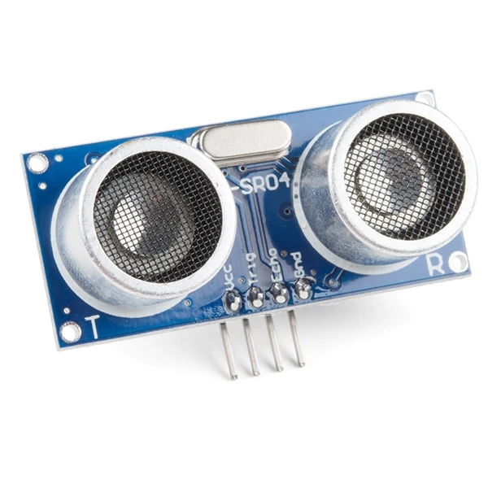

#ຕົວຢ່າງການນຳໃຊ້
- ຫຸ່ນຍົນຫຼີກວັດຖຸ (Obstacle Avoidance Robot)
- ລະບົບວັດລະດັບນ້ຳ
- ລະບົບຈອດລົດ (Parking sensor)
- ລະບົບກວດຈັບການເຄື່ອນໄຫວ
## 26.Sound sensor
ແມ່ນອຸປະກອນທີ່ໃຊ້ກວດຈັບລະດັບຄວາມແຮງຂອງສຽງຫຼືການມີຢູ່ຂອງສຽງ ໃນສະພາບແວດລ້ອມ.  
ສ່ວນໃຫຍ່ຈະໃຊ້ກັບ **Arduino**, **ESP32**, ຫຼື **Raspberry Pi** ເພື່ອເຮັດໂຄງການກວດຈັບສຽງ ເຊັ່ນ ໂຄງການຕື່ນໂດຍສຽງ ຫຼື ໄຟເປີດເມື່ອມີສຽງປັບເຂົ້າ.
#ການໃຊ້ງານຂອງອຸປະກອນ 
🧩 **ສ່ວນປະກອບຫຼັກ**
1. **Microphone (ໄມໂຄໂຟນ)** – ຮັບສຽງຈາກສິ່ງແວດລ້ອມ
2. **Amplifier Circuit (ວົງຈອນຂະຫຍາຍສຽງ)** – ເພີ່ມຄວາມແຮງຂອງສັນຍານສຽງ
3. **Comparator (ວົງຈອນປຽບທຽບ)** – ກວດຈັບວ່າສຽງແຮງພໍທີ່ຈະເກີນຄ່າກຳນົດຫຼືບໍ່
4. **Potentiometer (ຕົວຕ້ານປັບຄ່າໄດ້)** – ປັບຄ່າຄວາມໄວຂອງການກວດຈັບ
5. **LED Indicator** – ສະແດງສະຖານະເມື່ອກວດພົບສຽງ
⚙️ **ຫຼັກການເຮັດວຽກ**
6. ໄມໂຄໂຟນຮັບສຽງແລະແປງເປັນສັນຍານໄຟຟ້າ
7. ວົງຈອນຂະຫຍາຍຈະເພີ່ມຄ່າສັນຍານໃຫ້ຊັດເຈນຂຶ້ນ
8. Comparator ຈະປຽບທຽບຄ່າກັບຄ່າກຳນົດ (threshold)
    - ຖ້າສຽງແຮງກວ່າຄ່າທີ່ຕັ້ງ: **ສົ່ງສັນຍານ HIGH (1)**
    - ຖ້າສຽງອ່ອນກວ່າ: **ສົ່ງສັນຍານ LOW (0)**

⚡ **ຂາຕໍ່ພື້ນຖານ**

| ຂາ             | ຊື່                              | ໜ້າທີ່ |
| -------------- | -------------------------------- | ------ |
| VCC            | ຈ່າຍໄຟ 5V                        |        |
| GND            | ການດິນ                           |        |
| OUT            | ສົ່ງສັນຍານດິຈິຕອນ (0 ຫຼື 1)      |        |
| A0 _(ບາງຮຸ່ນ)_ | ສົ່ງສັນຍານແອນາລອກ (ຄ່າແຮງຂອງສຽງ) |        |

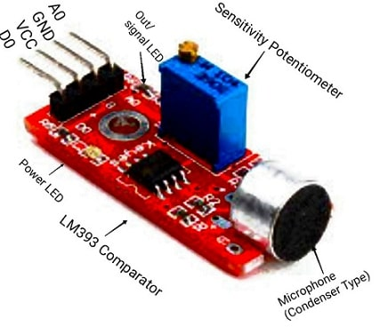
#ຕົວຢ່າງການນຳໃຊ້ 
💡 **ຕົວຢ່າງການນຳໃຊ້**
- ໂຄງການໄຟເປີດເມື່ອມີສຽງຕົບມື 👏
- ລະບົບກວດຈັບສຽງໃນຫ້ອງ
- ການວັດລະດັບຄວາມແຮງສຽງ (Noise Level Meter)
## 27.Water sensor
   ແມ່ນອຸປະກອນທີ່ໃຊ້ກວດຈັບການມີຢູ່ຂອງນ້ຳ ຫຼື ລະດັບນ້ຳ ໂດຍໃຊ້ຫຼັກການນຳໄຟຟ້າຂອງນ້ຳ.  
ເມື່ອນ້ຳສັມຜັດກັບແຜ່ນກວດຈັບ (sensor board) ຄ່າຄວາມຕ້ານທານຈະປ່ຽນແປງ ແລະໂມດູນຈະສົ່ງສັນຍານໃຫ້ກັບບອດຄວບຄຸມ (ເຊັ່ນ Arduino).
#ການໃຊ້ງານຂອງອຸປະກອນ 
**ສ່ວນປະກອບຂອງ Water Sensor**
1. **Water Detection Board (ແຜ່ນກວດຈັບນ້ຳ)** – ມີຮູບແບບເປັນເສັ້ນທອງແດງ (ຄ້າຍກັບແຜ່ນປິດວົງຈອນ) ໃຊ້ກວດຈັບການມີນ້ຳ
2. **Comparator Circuit (ໂມດູນປຽບທຽບ)** – ກວດຈັບຄ່າແຮງດັນຈາກແຜ່ນກວດຈັບ
3. **Potentiometer (ຕົວຕ້ານປັບຄ່າໄດ້)** – ປັບຄ່າຄວາມໄວໃນການກວດຈັບນ້ຳ
4. **LED Indicator** – ສະແດງສະຖານະເມື່ອກວດພົບນ້ຳ
⚙️ **ຫຼັກການເຮັດວຽກ**
5. ເມື່ອນ້ຳສັມຜັດກັບແຜ່ນກວດຈັບ, ນ້ຳຈະນຳໄຟຟ້າໄດ້ບາງສ່ວນ
6. ການນຳໄຟຟ້ານັ້ນເຮັດໃຫ້ຄ່າແຮງດັນທີ່ອອກຈາກແຜ່ນກວດຈັບປ່ຽນແປງ
7. Comparator ຈະປຽບທຽບຄ່ານັ້ນກັບຄ່າທີ່ກຳນົດໄວ້
    - ຖ້າກວດພົບນ້ຳ → ສົ່ງສັນຍານ **HIGH (1)**
    - ຖ້າບໍ່ມີນ້ຳ → ສົ່ງສັນຍານ **LOW (0)**
⚡ **ຂາຕໍ່ພື້ນຖານ**

|ຂາ|ຊື່|ໜ້າທີ່|
|---|---|---|
|VCC|ຈ່າຍໄຟ 5V||
|GND|ການດິນ||
|D0|ສັນຍານດິຈິຕອນ (ມີນ້ຳ/ບໍ່ມີນ້ຳ)||
|A0|ສັນຍານແອນາລອກ (ຄ່າລະດັບນ້ຳ)||

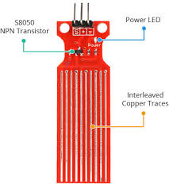
#ຕົວຢ່າງການນຳໃຊ້ 
- ການກວດຈັບນ້ຳຮົ່ວຫຼືນ້ຳລົ່ນ
- ລະບົບຕື່ນເມື່ອນ້ຳເຕັມຖັງ
- ລະບົບກວດຈັບຝົນ (Rain Detector)
- ຄວບຄຸມປັ໊ມນ້ຳອັດຕະໂນມັດ
## 28.Flame sensor
ແມ່ນອຸປະກອນທີ່ໃຊ້ເພື່ອກວດຈັບການມີຢູ່ຂອງແສງໄຟ ຫຼື ໄຟລຸກໄຫມ້ ໂດຍອາສັຍຫຼັກການຮັບຮູ້ຄືນຂອງຮັງສີ **infrared (IR)** ຫຼື **ultraviolet (UV)** ຈາກໄຟ.
#ການໃຊ້ງານຂອງອຸປະກອນ 
⚙️ ຫຼັກການເຮັດວຽກ
1. ຕົວ sensor ຈະມີ **photodiode** ຫຼື **infrared receiver**  
    → ມັນຈະຈັບຄືນຮັງສີທີ່ປ່ອຍອອກຈາກໄຟ.
2. ເມື່ອມີໄຟຢູ່ໃກ້ sensor  
    → sensor ຈະສົ່ງສັນຍານດິຈິຕອນ (Digital Output) ຫຼື ສັນຍານອະນາລັອກ (Analog Output) ໃຫ້ກັບ microcontroller (ເຊັ່ນ Arduino).
3. ຖ້າໄຟດັບ  
    → sensor ຈະບໍ່ສົ່ງສັນຍານຫຼືສົ່ງຄ່າຕໍ່າກັບ microcontroller.
🧩 ສ່ວນປະກອບຫຼັກ
- **Infrared receiver (photodiode)** – ຮັບແສງຈາກໄຟ
- **Comparator (ເຊັ່ນ LM393)** – ປຽບທຽບຄ່າແລະສົ່ງສັນຍານອອກ
- **Potentiometer** – ປັບຄ່າຄວາມໄວໃນການກວດຈັບ
- **LED indicator** – ສະແດງສະຖານະ (ມີໄຟ / ບໍ່ມີໄຟ)

#ຕົວຢ່າງການນຳໃຊ້ 
- ລະບົບກວດໄຟໄໝ້ໃນອາຄານ
- ລະບົບຄວບຄຸມຄວາມປອດໄພຂອງເຕົາກາດ
- ລະບົບປິດການຈ່າຍນໍ້າມັນອັດຕະໂນມັດເມື່ອມີໄຟໄໝ້
## 29. RFID module
ແມ່ນເທັກໂນໂລຊີທີ່ໃຊ້ຄືນຄວາມຖີ່ວິທະຍຸ (Radio Waves) ເພື່ອອ່ານ ຫຼື ຂຽນຂໍ້ມູນໃນ **Tag (ບັດ RFID)** ໂດຍບໍ່ຈຳເປັນຕ້ອງສຳຜັດໂດຍກົງ.
#ການໃຊ້ງານຂອງອຸປະກອນ 
⚙️ ຫຼັກການເຮັດວຽກ
1. **RFID Reader (Module)** ສົ່ງຄືນຄວາມຖີ່ວິທະຍຸອອກໄປ.
2. **RFID Tag / Card** ຈະຮັບຄືນນັ້ນ ແລະສົ່ງຂໍ້ມູນກັບຄືນມາ.
3. **Reader** ຈະຮັບຂໍ້ມູນນັ້ນ ແລະສົ່ງໃຫ້ **microcontroller (ເຊັ່ນ Arduino)** ເພື່ອປະມວນຜົນ.
🧩 ສ່ວນປະກອບຫຼັກຂອງ RFID System

|ສ່ວນ|ຄຳອະທິບາຍ|
|---|---|
|**RFID Tag / Card**|ມີຊີບຂໍ້ມູນທີ່ບັນທຶກ ID|
|**RFID Reader Module**|ອ່ານຄ່າຈາກ Tag|
|**Microcontroller (Arduino)**|ປະມວນຜົນຂໍ້ມູນທີ່ໄດ້|
|**Software / Serial Monitor**|ສະແດງຂໍ້ມູນທີ່ອ່ານໄດ້|
🔌 RFID Module ທີ່ນິຍົມ: **RC522**
- ສື່ສານຜ່ານ **SPI Interface**
- ຄວາມຖີ່ການທຳງານ: **13.56 MHz**
- ສາມາດອ່ານໄດ້ທັງ **Tag** ແລະ **Card**
📲 ການຕໍ່ກັບ Arduino UNO

|RFID RC522|Arduino UNO|
|---|---|
|3.3V|3.3V|
|RST|D9|
|GND|GND|
|MISO|D12|
|MOSI|D11|
|SCK|D13|
|SDA|D10|

#ຕົວຢ່າງການນຳໃຊ້ 
1. 🎫 ລະບົບເຂົ້າ-ອອກອາຄານ (Door Access System)
2. 🏫 ລະບົບລົງທະບຽນນັກສຶກສາ
3. 🚗 ລະບົບຈອດລົດອັດຕະໂນມັດ
4. 🏭 ການກວດຕິດຕາມສິນຄ້າ (Inventory Tracking)
5. 💰 ລະບົບຈ່າຍເງິນບັດແທນເງິນສົດ

## 30.RFID tag
ແມ່ນອຸປະກອນຂະຫນາດນ້ອຍທີ່ໃຊ້ເກັບຂໍ້ມູນຫຼືລະຫັດປະຈຳຕົວ (ID) ແລະສາມາດຖືກອ່ານໂດຍ **RFID Reader** ຜ່ານຄືນຄວາມຖີ່ວິທະຍຸ (Radio Waves) ໂດຍບໍ່ຈຳເປັນສຳຜັດໂດຍກົງ.
#ການໃຊ້ງານຂອງອຸປະກອນ 
 ⚙️ ຫຼັກການເຮັດວຽກ
1. **RFID Reader** ສົ່ງຄືນຄວາມຖີ່ວິທະຍຸອອກໄປ.
2. **Tag** ມີຂອງຂໍ້ມູນ (ເຊັ່ນ UID = Unique ID).
3. ເມື່ອຢູ່ໃນຊ່ວງສັນຍານ ມັນຈະຮັບພະລັງງານຈາກ Reader ແລະສົ່ງຂໍ້ມູນກັບຄືນໃຫ້.
4. **Reader** ຈະຮັບຂໍ້ມູນນັ້ນ ແລະສົ່ງໃຫ້ **Microcontroller (ເຊັ່ນ Arduino)** ເພື່ອປະມວນຜົນ.
🧩 ສ່ວນປະກອບຂອງ RFID Tag
5. **Microchip (IC)** – ບັນທຶກຂໍ້ມູນຫຼື ID
6. **Antenna (ສາຍຂວຽນ)** – ຮັບສັນຍານວິທະຍຸຈາກ Reader
7. **Substrate (ວັດຖຸຮອງ)** – ຮັບໃຊ້ໃນການປະກອບແລະປົກປ້ອງຊີບ

 🔢 ປະເພດຂອງ RFID Tag

|ປະເພດ|ຄຳອະທິບາຍ|
|---|---|
|**Passive Tag**|ບໍ່ມີແບັດເຕີຣີ, ຮັບພະລັງງານຈາກ Reader (ທີ່ນິຍົມໃຊ້ຫຼາຍສຸດ)|
|**Active Tag**|ມີແບັດເຕີຣີໃນຕົວ, ສາມາດສົ່ງສັນຍານໄດ້ໄກ|
|**Semi-Active Tag**|ມີແບັດເຕີຣີ ແຕ່ໃຊ້ພະລັງງານພຽງເມື່ອມີ Reader ຢູ່ໃກ້|
📶 ຊ່ວງຄວາມຖີ່ຂອງ RFID

|ປະເພດ|ຄວາມຖີ່|ຊ່ວງອ່ານ|
|---|---|---|
|**LF (Low Frequency)**|125 kHz|5–10 cm|
|**HF (High Frequency)**|13.56 MHz|10–30 cm|
|**UHF (Ultra High Frequency)**|860–960 MHz|1–10 m|
 🔸 ບັດ RFID ທີ່ໃຊ້ກັບ Arduino RC522 ແມ່ນໃນກຸ່ມ **HF 13.56 MHz**
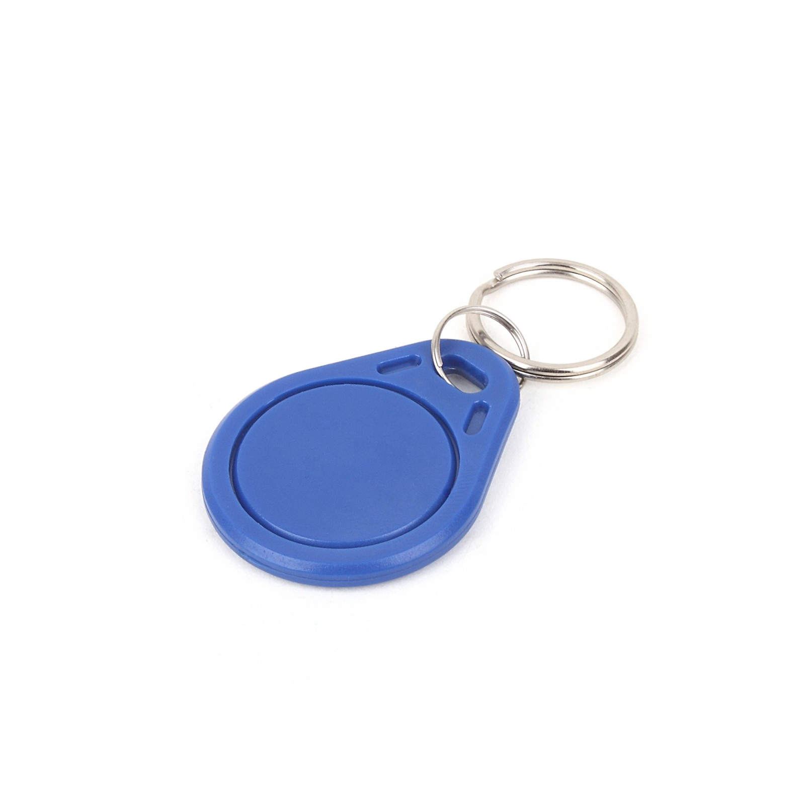
#ຕົວຢ່າງການນຳໃຊ້ 
- 🎫 **ບັດເຂົ້າອາຄານ** – ນຳບັດແຕະ Reader ເພື່ອເຂົ້າປະຕູ
- 🏫 **ບັດນັກຮຽນ / ນັກສຶກສາ** – ລົງທະບຽນເຂົ້າ-ອອກ
- 🚗 **ລະບົບຈອດລົດອັດຕະໂນມັດ** – ຈຳລະຄ່າຈອດລົດດ້ວຍບັດ
- 📦 **ການຕິດຕາມສິນຄ້າ** – ຕິດ Tag ໄວ້ທີ່ກ່ອງສິນຄ້າເພື່ອກວດຕາມສະຖານທີ່
- 💳 **ບັດຈ່າຍເງິນ (E-wallet / Smart card)** – ຈ່າຍເງິນໂດຍບໍ່ຕ້ອງໃຊ້ເງິນສົດ
## 31. Infrared receiver
ແມ່ນອຸປະກອນອີເລັກໂທຣນິກທີ່ຖືກອອກແບບມາເພື່ອ **ກວດຈັບ** ແລະ **ຮັບ** ສັນຍານທີ່ປ່ອຍອອກມາໃນຮູບແບບຂອງ **ແສງ Infrared (ຄື້ນຄວາມຮ້ອນ)**.
#ການໃຊ້ງານຂອງອຸປະກອນ 
ການເຮັດວຽກໃນໂໝດການສື່ສານ (Remote Control)
ອັນນີ້ແມ່ນຫຼັກການທີ່ໃຊ້ໃນການຄວບຄຸມໂທລະພາບ ຫຼື ເຄື່ອງປັບອາກາດ:
1. **ການສົ່ງສັນຍານ (IR Transmitter):** ເມື່ອກົດປຸ່ມເທິງຣີໂມດ, ຊິບໃນຣີໂມດຈະປ່ຽນລະຫັດຄໍາສັ່ງດິຈິຕອລ (ເຊັ່ນ: ເປີດ/ປິດ) ໃຫ້ເປັນ **ສັນຍານແສງ IR ທີ່ຖືກປັບສັນຍານ (Modulated Signal)** ດ້ວຍຄວາມຖີ່ຂອງຄື້ນພາຫະນະ (Carrier Frequency) ສະເພາະ (ເຊັ່ນ: 38 kHz).
2. **ການຮັບສັນຍານ (IR Receiver):**
    - IR Receiver ຈະຮັບເອົາແສງ IR ເຫຼົ່ານີ້.
    - ມັນຈະກວດຈັບສະເພາະແສງ IR ທີ່ຖືກປັບສັນຍານດ້ວຍຄວາມຖີ່ທີ່ກຳນົດໄວ້ເທົ່ານັ້ນ, ເຊິ່ງຊ່ວຍ **ກັ່ນຕອງສິ່ງລົບກວນ** ຈາກແສງ IR ທຳມະຊາດ (ເຊັ່ນ: ແສງຕາເວັນ ຫຼື ໄຟທຽນ).
    - ຈາກນັ້ນ, ມັນຈະ **ຖອດລະຫັດ (Demodulate)** ສັນຍານອອກ ເພື່ອໃຫ້ໄດ້ **ລະຫັດດິຈິຕອລ** ຕົ້ນສະບັບ (ຄືຄຳສັ່ງ: ເປີດ/ປິດ).
3. **ການປະມວນຜົນ:** ລະຫັດດິຈິຕອລນີ້ຈະຖືກສົ່ງໄປຫາ Microcontroller ຂອງອຸປະກອນ (ເຊັ່ນ: ໂທລະພາບ) ເພື່ອປະຕິບັດຕາມຄຳສັ່ງ.
ຂ. ການເຮັດວຽກໃນໂໝດເຊັນເຊີກວດຈັບວັດຖຸ (IR Proximity Sensor)
- **ລະບົບຄູ່:** ເຊັນເຊີປະເພດນີ້ຈະມີອົງປະກອບ 2 ສ່ວນຄື: IR LED (ຕົວສົ່ງແສງ) ແລະ Photodiode (ຕົວຮັບແສງ).
- **ການກວດຈັບ:**
    - IR LED ຈະ **ສົ່ງແສງ IR** ອອກໄປຢ່າງຕໍ່ເນື່ອງ.
    - ຖ້າ **ບໍ່ມີວັດຖຸ** ຢູ່ຕໍ່ໜ້າ, ແສງ IR ຈະກະຈາຍໄປ ແລະ ບໍ່ມີແສງກັບຄືນມາຫາ Photodiode.
    - ຖ້າມີ **ວັດຖຸ** ມາຢູ່ຕໍ່ໜ້າ, ແສງ IR ຈະ **ສະທ້ອນ** ກັບມາຫາ Photodiode (ເຄື່ອງຮັບ).
    - ເມື່ອ Photodiode ໄດ້ຮັບແສງສະທ້ອນ, ວົງຈອນຈະປ່ຽນແປງຄ່າໄຟຟ້າ, ເຮັດໃຫ້ຮູ້ວ່າ **ມີວັດຖຸ** ຢູ່ໃກ້.
    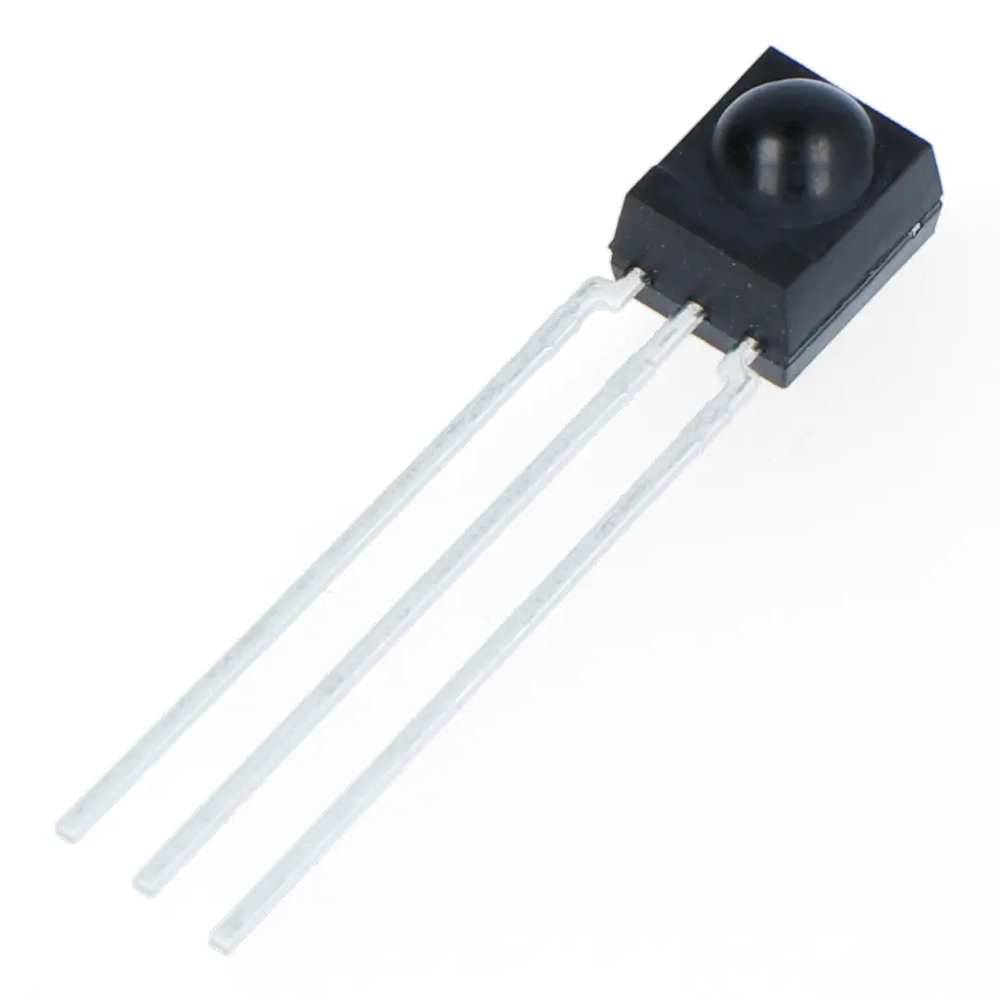
#ຕົວຢ່າງການນຳໃຊ້ 
Infrared Receiverແມ່ນເຕັກໂນໂລຊີພື້ນຖານທີ່ມີການນຳໃຊ້ຢ່າງຫຼາກຫຼາຍ:

|**ຫົວຂໍ້ການນຳໃຊ້**|**ລາຍລະອຽດ**|
|---|---|
|**Home Appliance Control**|**ການຄວບຄຸມເຄື່ອງໃຊ້ໃນເຮືອນ:** ຣີໂມດໂທລະພາບ, ເຄື່ອງຫຼິ້ນ DVD, ໂຄມໄຟ, ແລະ ເຄື່ອງປັບອາກາດລ້ວນແຕ່ໃຊ້ IR Receiver ເພື່ອຮັບຄຳສັ່ງຈາກຣີໂມດ.|
|**DIY Remote Control Projects**|**ໂຄງການຄວບຄຸມດ້ວຍຣີໂມດ (DIY):** ໃຊ້ IR Receiver ເພື່ອຄວບຄຸມ Arduino ໃຫ້ເປີດ/ປິດໄຟ, ປັບລະດັບສຽງ, ຫຼື ຄວບຄຸມຫຸ່ນຍົນດ້ວຍຣີໂມດເກົ່າ.|
|**Obstacle Avoidance Robot**|**ຫຸ່ນຍົນຫຼີກລ້ຽງສິ່ງກີດຂວາງ:** ໃຊ້ເຊັນເຊີ IR Proximity (ຕົວສົ່ງແລະຕົວຮັບຄູ່ກັນ) ເພື່ອກວດຈັບວັດຖຸທີ່ຢູ່ທາງໜ້າ ເພື່ອບໍ່ໃຫ້ຫຸ່ນຍົນຕຳ.|
|**Line Follower Robot**|**ຫຸ່ນຍົນຕິດຕາມເສັ້ນ:** ໃຊ້ເຊັນເຊີ IR Proximity ຫຼາຍຕົວເພື່ອແຍກແຍະລະຫວ່າງພື້ນຜິວທີ່ສະທ້ອນແສງ (ເຊັ່ນ: ສີຂາວ) ກັບພື້ນຜິວທີ່ດູດຊຶມແສງ (ເຊັ່ນ: ສີດຳ) ເພື່ອຕິດຕາມເສັ້ນທາງທີ່ຖືກກຳນົດໄວ້.|
|**Motion/Security Sensor**|**ເຊັນເຊີກວດຈັບການເຄື່ອນໄຫວ (PIR):** ເຖິງແມ່ນວ່າຈະເປັນ Passive IR, ແຕ່ມັນຍັງໃຊ້ຄື້ນ IR. ມັນກວດຈັບການປ່ຽນແປງຂອງຄວາມຮ້ອນ (ແສງ IR) ທີ່ປ່ອຍອອກມາຈາກຮ່າງກາຍຂອງຄົນ, ໃຊ້ໃນລະບົບປຸກ ແລະ ໄຟເປີດອັດຕະໂນມັດ.|

## **32. Infrared remote control** 
ແມ່ນອຸປະກອນໄຮ້ສາຍຂະໜາດນ້ອຍທີ່ໃຊ້ໃນການຄວບຄຸມເຄື່ອງໃຊ້ໄຟຟ້າຈາກໄລຍະໄກ. ມັນເຮັດວຽກໂດຍການສົ່ງຄຳສັ່ງໃນຮູບແບບຂອງ **ແສງ Infrared** (ແສງທີ່ມະນຸດເບິ່ງບໍ່ເຫັນ) ໄປຫາເຄື່ອງຮັບ IR ທີ່ຕິດຢູ່ກັບອຸປະກອນເປົ້າໝາຍ (ເຊັ່ນ: ໂທລະພາບ, ເຄື່ອງປັບອາກາດ). ໃຊ້ໃນການຄວບຄຸບອຸປະກອນ ຫຼື ລະບົບໄລຍະໄກ ຂະບວນການສົ່ງຄໍາສັ່ງຈາກຣີໂມດໄປຫາອຸປະກອນຈະເກີດຂຶ້ນໃນ 3 ຂັ້ນຕອນຫຼັກ:
 ກ. ການປ່ຽນລະຫັດ (Encoding)
1. **ກົດປຸ່ມ:** ເມື່ອກົດປຸ່ມໃດໜຶ່ງເທິງຣີໂມດ (ເຊັ່ນ: ປຸ່ມ "Channel Up"), ວົງຈອນພາຍໃນຈະກວດຈັບການເຊື່ອມຕໍ່ໄຟຟ້າ.
2. **ສ້າງລະຫັດ Binary:** IC ພາຍໃນຣີໂມດຈະປ່ຽນການກົດປຸ່ມນັ້ນໃຫ້ເປັນ **ລະຫັດດິຈິຕອລສະເພາະ** (ເຊັ່ນ: 01011001) ທີ່ເປັນເອກະລັກສະເພາະສຳລັບຄຳສັ່ງນັ້ນ ແລະ ສຳລັບອຸປະກອນນັ້ນ (Address Code).
3. **ປັບສັນຍານ (Modulation):** ເພື່ອໃຫ້ເຄື່ອງຮັບສາມາດແຍກສັນຍານຈາກຣີໂມດອອກຈາກແສງ IR ທຳມະຊາດ (ເຊັ່ນ: ແສງແດດ), ລະຫັດ Binary ຈະຖືກໃຊ້ເພື່ອເປີດ-ປິດ IR LED ດ້ວຍຄວາມຖີ່ຂອງຄື້ນພາຫະນະທີ່ສູງ (ປົກກະຕິແມ່ນ 38 kHz). ນີ້ແມ່ນການສົ່ງຄໍາສັ່ງຜ່ານກຳມະຈອນແສງ IR.
ຂ. ການສົ່ງແລະຮັບສັນຍານ (Transmission)
4. **ການສົ່ງ:** IR LED ຈະປ່ອຍກຳມະຈອນແສງ IR ອອກໄປສູ່ອາກາດ.
5. **ເງື່ອນໄຂສຳຄັນ:** ການສົ່ງສັນຍານ IR **ຕ້ອງການ Line-of-Sight (ຕ້ອງເຫັນກັນໂດຍກົງ)** ລະຫວ່າງຣີໂມດກັບເຄື່ອງຮັບ. ແສງ IR ບໍ່ສາມາດຜ່ານຝາ ຫຼື ສິ່ງກີດຂວາງໄດ້ (ແຕ່ມັນສາມາດສະທ້ອນກັບຝາ ຫຼື ເພດານໄດ້).
 ຄ. ການຖອດລະຫັດແລະປະຕິບັດ (Decoding)
6. **ການຮັບ:** IR Receiver ທີ່ຢູ່ໃນອຸປະກອນ (ເຊັ່ນ: ໂທລະພາບ) ຈະກວດຈັບກຳມະຈອນແສງ IR ເຫຼົ່ານັ້ນ.
7. **ການກັ່ນຕອງແລະຖອດລະຫັດ:** ເຄື່ອງຮັບຈະກັ່ນຕອງເອົາສະເພາະຄວາມຖີ່ຂອງຄື້ນພາຫະນະທີ່ມັນຖືກອອກແບບມາໃຫ້ຮັບ (38 kHz) ແລະ ຖອດລະຫັດອອກມາເປັນລະຫັດ Binary ດິຈິຕອລຕົ້ນສະບັບ.
8. **ປະຕິບັດຄຳສັ່ງ:** ລະຫັດ Binary ຈະຖືກສົ່ງໄປຫາ Microprocessor ຂອງອຸປະກອນ ເຊິ່ງຈະແປລະຫັດນັ້ນເປັນຄຳສັ່ງທີ່ເຂົ້າໃຈໄດ້ (ເຊັ່ນ: ເພີ່ມລະດັບສຽງ, ປ່ຽນຊ່ອງ, ປິດ).

#ຕົວຢ່າງການນຳໃຊ້ 
IR Remote Control ຍັງຄົງເປັນມາດຕະຖານໃນການຄວບຄຸມອຸປະກອນເອເລັກໂທຣນິກພາຍໃນເຮືອນ ເນື່ອງຈາກຕົ້ນທຶນຕໍ່າແລະຄວາມເຊື່ອຖືໄດ້:

|**ຫົວຂໍ້ການນຳໃຊ້**|**ລາຍລະອຽດ**|
|---|---|
|**Consumer Electronics**|**ເຄື່ອງໃຊ້ເພື່ອຄວາມບັນເທິງ:** ໂທລະພາບ, ເຄື່ອງຫຼິ້ນ DVD/Blu-ray, ເຄື່ອງຮັບສັນຍານດາວທຽມ/ສາຍເຄເບິນ, ແລະ ເຄື່ອງສຽງ Stereo.|
|**Home Climate Control**|**ການຄວບຄຸມອຸນຫະພູມ:** ຣີໂມດຄວບຄຸມເຄື່ອງປັບອາກາດ (Air Conditioner), ພັດລົມ, ແລະ ເຄື່ອງເຮັດຄວາມຮ້ອນ.|
|**Projectors and Displays**|**ອຸປະກອນການນຳສະເໜີ:** ຣີໂມດສຳລັບເຄື່ອງໂປຣເຈັກເຕີ ແລະ ບາງຈໍສະແດງຜົນ (ຄວບຄຸມການເປີດ/ປິດ ແລະ ການປ່ຽນ Input).|
|**Smart Home Integration**|**ການຄວບຄຸມເຮືອນອັດສະລິຍະ:** ໃຊ້ IR Blasters (ອຸປະກອນສົ່ງ IR ແບບສູນກາງ) ເພື່ອລວມການຄວບຄຸມອຸປະກອນ IR ເກົ່າເຂົ້າໃນລະບົບເຮືອນອັດສະລິຍະ (Smart Home).|
|**Toys and Robotics**|**ຂອງຫຼິ້ນຄວບຄຸມ:** ລົດບັງຄັບ ຫຼື ຫຸ່ນຍົນຂອງຫຼິ້ນແບບງ່າຍໆ ທີ່ໃຊ້ IR ສຳລັບການສື່ສານໄລຍະໃກ້.|

## **33.Joystick module** 
  ແມ່ນອຸປະກອນປ້ອນຂໍ້ມູນ (Input Device) ທີ່ຖືກອອກແບບມາເພື່ອວັດແທກ ການເຄື່ອນໄຫວໃນ 2 ມິຕິ (2-axis) (ແນວນອນ (X-axis) ແລະ ແນວຕັ້ງ (Y-axis)) ໂດຍປົກກະຕິແລ້ວມັນຈະຄ້າຍຄືກັບ joystick ທີ່ພົບໃນເຄື່ອງຫຼິ້ນເກມ PS2 ຫຼື Xbox. ໃຊ້ໃນຫຸ່ນຍົນ ຫຼື ເກມເພື່ອການຄວບຄຸມທິດທາງ Joystick Module ເຮັດວຽກໂດຍອີງໃສ່ຫຼັກການຂອງ **ຕົວຕ້ານທານປັບຄ່າໄດ້ (Potentiometer)**.
 ກ. ສ່ວນປະກອບຫຼັກ
ໂມດູນ joystick ປະກອບດ້ວຍ 3 ສ່ວນຫຼັກທີ່ໃຫ້ສັນຍານອອກ:
1. **Potentiometer ສຳລັບແກນ X (VRx):** ໃຊ້ສຳລັບວັດແທກການເຄື່ອນໄຫວ ຊ້າຍ - ຂວາ.
2. **Potentiometer ສຳລັບແກນ Y (VRy):** ໃຊ້ສຳລັບວັດແທກການເຄື່ອນໄຫວ ເທິງ - ລຸ່ມ.
3. **ປຸ່ມກົດ (Switch/SW):** ໃຫ້ສັນຍານ **Digital** (ກົດ/ບໍ່ກົດ).
4. ຂ. ຫຼັກການເຮັດວຽກ
- **Potentiometer:** Potentiometer ແຕ່ລະອັນຖືກເຊື່ອມຕໍ່ລະຫວ່າງແຮງດັນໄຟຟ້າ (VCC 5V) ແລະ ດິນ (GND). ມັນເຮັດໜ້າທີ່ເປັນ Voltage Divider.
- **ການເຄື່ອນໄຫວ:** ເມື່ອຍ້າຍ joystick:
    - ກົນໄກພາຍໃນ (Gimbal mechanism) ຈະໝູນແກນ X ແລະ/ຫຼື ແກນ Y.
    - ການໝູນນີ້ຈະປ່ຽນຕໍາແໜ່ງຂອງ Potentiometer ທັງສອງຕາມລຳດັບ.
    - ການປ່ຽນແປງຂອງຕໍາແໜ່ງ Potentiometer ເຮັດໃຫ້ ແຮງດັນໄຟຟ້າອອກ (Analog Voltage) ຢູ່ປາຍ VRx ແລະ VRy ປ່ຽນແປງ.
- **ການອ່ານຄ່າ:**
    - **ຕຳແໜ່ງພັກ (Center):** ເມື່ອ joystick ຢູ່ກາງ (ບໍ່ໄດ້ຍ້າຍ), ແຮງດັນອອກຈະຢູ່ທີ່ເຄິ່ງໜຶ່ງຂອງແຮງດັນສະໜອງ (ເຊັ່ນ: ປະມານ 2.5V ຖ້າໃຊ້ 5V), ເຊິ່ງ Microcontroller (ເຊັ່ນ: Arduino) ຈະອ່ານຄ່າໄດ້ປະມານ 512 (ຄ່າເຕັມ 0 ຫາ 1023).
    - **ການເຄື່ອນທີ່:** ເມື່ອຍ້າຍ joystick ໄປໃນທິດທາງໃດໜຶ່ງ, ຄ່າຈະປ່ຽນຈາກ 0 (ປາຍສຸດໜຶ່ງ) ໄປຫາ 1023 (ປາຍສຸດອີກດ້ານໜຶ່ງ).
- **ປຸ່ມກົດ (SW):** ໃຫ້ສັນຍານ LOW (0V) ເມື່ອກົດ ແລະ HIGH (VCC) ເມື່ອບໍ່ໄດ້ກົດ.
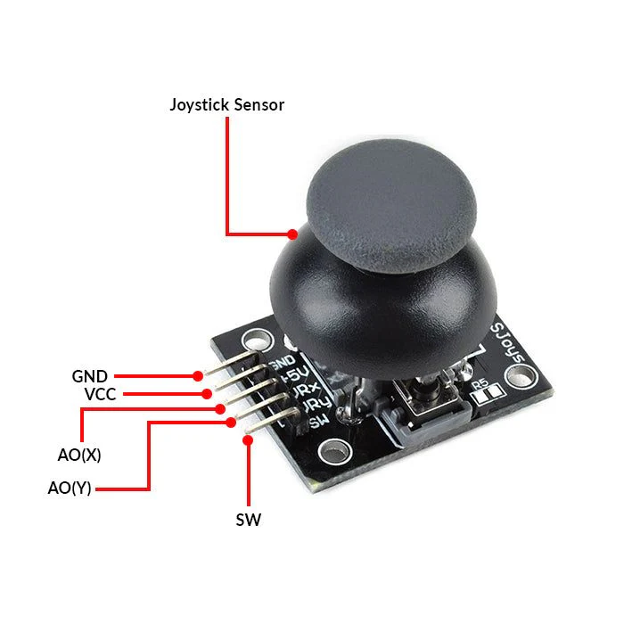
#ຕົວຢ່າງການນຳໃຊ້ 
Joystick Module ແມ່ນອຸປະກອນປ້ອນຂໍ້ມູນທີ່ນິຍົມທີ່ສຸດໃນໂຄງການ DIY ເນື່ອງຈາກຄວາມສາມາດໃນການຄວບຄຸມ 2 ມິຕິ:

|**ຫົວຂໍ້ການນຳໃຊ້**|**ລາຍລະອຽດ**|
|---|---|
|**Robotics Control**|**ການຄວບຄຸມຫຸ່ນຍົນ:** ໃຊ້ joystick ເພື່ອຄວບຄຸມການເຄື່ອນທີ່ຂອງຫຸ່ນຍົນ RC (ລົດບັງຄັບ, ຫຸ່ນຍົນແຂນ) ໂດຍກຳນົດທິດທາງ (X}, \text{Y) ແລະ ຄວາມໄວ.|
|**Servo/Stepper Motor Control**|**ຄວບຄຸມ Motor:** ໃຊ້ joystick ເພື່ອຄວບຄຸມຕຳແໜ່ງຂອງ Servo Motor 2 ອັນ (ສຳລັບແກນ X ແລະ Y) ເຊັ່ນ: ການຄວບຄຸມກ້ອງ ຫຼື ຫົວຈັບ (gripper) ຂອງແຂນຫຸ່ນຍົນ.|
|**DIY Game Controllers**|**ເຄື່ອງຄວບຄຸມເກມ DIY:** ສ້າງເຄື່ອງຄວບຄຸມເກມແບບງ່າຍດາຍສຳລັບຄອມພິວເຕີ ຫຼື ເກມທີ່ສ້າງຂຶ້ນເອງໃນ Microcontroller.|
|**Cursor/Menu Navigation**|**ການເລື່ອນເມນູ:** ໃຊ້ joystick ເພື່ອເລື່ອນຕົວຊີ້ (cursor) ຫຼື ເລືອກລາຍການໃນເມນູທີ່ສະແດງເທິງໜ້າຈໍ LCD ຫຼື OLED. ປຸ່ມກົດ SW ສາມາດໃຊ້ເປັນປຸ່ມເລືອກ (Select).|
|**LED Matrix Control**|**ຄວບຄຸມ LED Matrix:** ໃຊ້ joystick ເພື່ອຍ້າຍຮູບພາບ ຫຼື ຈຸດໄຟຢູ່ເທິງກະດານໄຟ LED ທີ່ມີຂະໜາດໃຫຍ່.|

## 34. 4x4 Matrix Keyboard Module
  ແມ່ນອຸປະກອນປ້ອນຂໍ້ມູນ (Input Device) ທີ່ປະກອບດ້ວຍ **16 ປຸ່ມ** ທີ່ຈັດລຽງເປັນຮູບແບບ **4 ແຖວ (Rows) ແລະ 4 ຖັນ (Columns) (4 * 4)**. ມັນຖືກນໍາໃຊ້ເພື່ອຮັບຄ່າປ້ອນຂໍ້ມູນ (input) ຈາກຜູ້ໃຊ້ໃນໂຄງການໄມໂຄຄອນໂທນເລີ (Microcontroller) ເຊັ່ນ: Arduino ຫຼື Raspberry Pi. ໃຊ້ສຳລັບການປ້ອນລະຫັດຜ່ານ, ການເລືອກອິນພຸດ ຫຼື ການຄວບຄຸມລະບົບ ການເຮັດວຽກຂອງ 4x4 Matrix Keyboard ແມ່ນອີງໃສ່ເຕັກນິກທີ່ເອີ້ນວ່າ **ການສະແກນ Matrix** ເພື່ອກໍານົດວ່າປຸ່ມໃດຖືກກົດໂດຍການສົ່ງ ແລະ ອ່ານສັນຍານຜ່ານແຖວ ແລະ ຖັນ.
 ກ. ໂຄງສ້າງພາຍໃນ
ພາຍໃຕ້ປຸ່ມກົດແຕ່ລະອັນ ແມ່ນມີປຸ່ມກົດແບບງ່າຍດາຍ (Simple Switch).
- ປາຍສາຍໄຟຂອງປຸ່ມກົດແຕ່ລະອັນໃນແຖວໜຶ່ງຖືກເຊື່ອມຕໍ່ເຂົ້າກັນ.
- ປາຍສາຍໄຟຂອງປຸ່ມກົດແຕ່ລະອັນໃນຖັນໜຶ່ງຖືກເຊື່ອມຕໍ່ເຂົ້າກັນ.
ຂ. ຫຼັກການສະແກນ (Scanning Algorithm)
   Microcontroller ຈະເຮັດວຽກເປັນຂັ້ນຕອນເພື່ອຊອກຫາຈຸດຕັດກັນຂອງແຖວແລະຖັນທີ່ຖືກເຊື່ອມຕໍ່:
1. **ກໍານົດວ່າມີການກົດປຸ່ມແລ້ວບໍ່:**
    - Microcontroller ຕັ້ງຄ່າ 4 pins ຂອງແຖວ (Rows) ໃຫ້ເປັນຜົນອອກ (Output) ແລະ ສົ່ງຄ່າໄຟຟ້າ **LOW (0)** ໄປທັງ 4 ແຖວ.
    - Microcontroller ຕັ້ງຄ່າ 4 pins ຂອງຖັນ (Columns) ໃຫ້ເປັນປ້ອນເຂົ້າ (Input) ໂດຍມີ Pull-up Resistor (ເຮັດໃຫ້ມັນເປັນຄ່າ **HIGH (1)** ໂດຍຄ່າເລີ່ມຕົ້ນ).
    - ຖ້າມີປຸ່ມໃດຖືກກົດ, ມັນຈະເຮັດໃຫ້ແຖວທີ່ເປັນ LOW ເຊື່ອມຕໍ່ກັບຖັນ. ດັ່ງນັ້ນ, ຖັນນັ້ນຈະປ່ຽນຈາກ HIGH ໄປເປັນ **LOW**.
    - ຖ້າ Microcontroller ອ່ານໄດ້ຄ່າ LOW ຈາກຖັນໃດໜຶ່ງ, ມັນຮູ້ວ່າມີການກົດປຸ່ມແລ້ວ.
2. **ການກໍານົດຕໍາແໜ່ງຂອງປຸ່ມທີ່ຖືກກົດ:**
    - ເມື່ອກວດພົບການກົດ, Microcontroller ຈະເລີ່ມຂະບວນການສະແກນ:
    - ມັນຈະສົ່ງຄ່າ **LOW (0)** ໄປທີ່ແຖວເທື່ອລະອັນ (ສ່ວນແຖວອື່ນຍັງຄົງເປັນ HIGH).
    - ໃນຂະນະທີ່ແຖວໃດໜຶ່ງເປັນ LOW, ມັນຈະກວດສອບຄ່າຂອງ 4 ຖັນ.
    - **ຈຸດຕັດກັນ:** ແຖວໃດທີ່ເຮັດໃຫ້ຄ່າຂອງຖັນກາຍເປັນ **LOW**, ນັ້ນແມ່ນຕໍາແໜ່ງຂອງປຸ່ມທີ່ຖືກກົດ.
        - **ຕົວຢ່າງ:** ຖ້າສົ່ງ LOW ໄປທີ່ **ແຖວ 2** ແລະ ຖັນ **Column 3** ກາຍເປັນ LOW, ປຸ່ມທີ່ຖືກກົດແມ່ນປຸ່ມທີ່ຢູ່ຈຸດຕັດກັນຂອງ **ແຖວ 2 ແລະ ຖັນ 3**.

#ຕົວຢ່າງການນຳໃຊ້ 
  4x4 Matrix Keyboard Module ເປັນທາງເລືອກທີ່ດີເລີດສຳລັບການນຳໃຊ້ທີ່ຕ້ອງການການປ້ອນຂໍ້ມູນເປັນຕົວເລກ ຫຼື ເປັນຕົວອັກສອນງ່າຍໆ:

|**ຫົວຂໍ້ການນຳໃຊ້**|**ລາຍລະອຽດ**|
|---|---|
|**Digital Lock System (Keypad Security)**|**ລະບົບລັອກລະຫັດ:** ໃຊ້ແປ້ນພິມເພື່ອປ້ອນລະຫັດຜ່ານ (PIN) ເພື່ອຄວບຄຸມການເປີດ/ປິດ ປະຕູ, ຕູ້ເຊບ, ຫຼື ເປີດເຄື່ອງຈັກ.|
|**Calculator (DIY) (4 * 4)**|**ເຄື່ອງຄິດເລກ DIY:** ປຸ່ມຕ່າງໆສາມາດຖືກກໍານົດໃຫ້ເປັນຕົວເລກ (0-9), ແລະ ສັນຍາລັກທາງຄະນິດສາດ (+, -, *, /) ເພື່ອສ້າງເຄື່ອງຄິດເລກຂະໜາດນ້ອຍ.|
|**Menu Navigation & Data Entry**|**ການເລືອນເມນູ ແລະ ປ້ອນຂໍ້ມູນ:** ໃຊ້ແປ້ນພິມນີ້ເພື່ອປ້ອນຄ່າຕ່າງໆ (setting), ເລືອກທາງເລືອກໃນເມນູທີ່ສະແດງຢູ່ໃນໜ້າຈໍ LCD ຫຼື OLED.|
|**Simple Game Controller**|**ເຄື່ອງຄວບຄຸມເກມແບບງ່າຍດາຍ:** ປຸ່ມສາມາດໃຊ້ເປັນປຸ່ມຄວບຄຸມ Up, Down, Left, Right ແລະ ປຸ່ມຟັງຊັນຕ່າງໆສຳລັບເກມແບບງ່າຍດາຍ.|

## **35. Relay module** 
ແມ່ນແຜງວົງຈອນທີ່ປະກອບດ້ວຍອຸປະກອນ **ຣີເລ (Relay) ໄຟຟ້າ-ແມ່ເຫຼັກ (Electromagnetic Relay)** ແລະ ອົງປະກອບເສີມອື່ນໆ (Diode, Transistor, LED). ມັນເຮັດໜ້າທີ່ເປັນ **ສະວິດໄຟຟ້າ (Electrically Operated Switch)**. ໃຊ້ໃນການຄວບຄຸມມໍເຕີ, ໄຟ, ຫຼື ເຄື່ອງໃຊ້ໄຟຟ້າອື່ນໆ ຫຼັກການເຮັດວຽກຂອງ Relay Module ແມ່ນອີງໃສ່ການໃຊ້ແມ່ເຫຼັກໄຟຟ້າ (Electromagnet) ເພື່ອຄວບຄຸມການເປີດ/ປິດຂອງໜ້າສໍາຜັດທາງກົນຈັກ (Mechanical Contacts) ໃນວົງຈອນອື່ນ.

|**ຂັ້ນຕອນ**|**ການກະທໍາ**|**ລາຍລະອຽດ**|
|---|---|---|
|**1. ປ້ອນສັນຍານຄວບຄຸມ**|**Microcontroller ສົ່ງສັນຍານ (HIGH ຫຼື LOW)** ໄປທີ່ pin ປ້ອນເຂົ້າ (IN) ຂອງ Relay Module.|ສັນຍານນີ້ກະຕຸ້ນ transistor ທີ່ຢູ່ໃນໂມດູນເພື່ອໃຫ້ກະແສໄຟຟ້າໄຫຼເຂົ້າສູ່ Coil (ຂົດລວດ).|
|**2. ການສ້າງແມ່ເຫຼັກ**|ກະແສໄຟຟ້າໄຫຼຜ່ານ Coil ຂອງ Relay.|ສິ່ງນີ້ສ້າງສະໜາມແມ່ເຫຼັກ (Magnetic Field).|
|**3. ການປ່ຽນຕໍາແໜ່ງສະວິດ**|ສະໜາມແມ່ເຫຼັກດຶງດູດ Armature (ແຂນໂລຫະທີ່ເຄື່ອນທີ່ໄດ້) ພາຍໃນ Relay.|ການເຄື່ອນໄຫວນີ້ເຮັດໃຫ້ **ໜ້າສຳຜັດ (Contacts)** ປ່ຽນຕຳແໜ່ງ (ເປີດ ຫຼື ປິດ).|
|**4. ຄວບຄຸມວົງຈອນໂຫຼດ**|- ຖ້າໃຊ້ຈຸດ **NO (Normally Open)**: ວົງຈອນຈະ **ປິດ** (Load ເປີດ). - ຖ້າໃຊ້ຈຸດ **NC (Normally Closed)**: ວົງຈອນຈະ **ເປີດ** (Load ປິດ).|ວົງຈອນໂຫຼດທີ່ມີພະລັງງານສູງຖືກເປີດ ຫຼື ປິດໂດຍການກະທໍານີ້.|

#ຕົວຢ່າງການນຳໃຊ້ 
Relay Module ແມ່ນພື້ນຖານຂອງໂຄງການອັດຕະໂນມັດ ແລະ ລະບົບ IoT (ອິນເຕີເນັດຂອງສິ່ງຂອງ) ສ່ວນໃຫຍ່, ໂດຍສະເພາະບ່ອນທີ່ຕ້ອງຄວບຄຸມໄຟຟ້າບ້ານ (AC Mains).

|**ຫົວຂໍ້ການນຳໃຊ້**|**ລາຍລະອຽດ**|
|---|---|
|**Home Automation (Smart Home)**|**ລະບົບໄຟອັດສະລິຍະ:** ຄວບຄຸມການເປີດ/ປິດໄຟສາຍ, ພັດລົມ, ຫຼື ເຄື່ອງໃຊ້ໄຟຟ້າພາຍໃນເຮືອນຜ່ານແອັບຯ (Wi-Fi) ຫຼື ຜ່ານເຊັນເຊີ.|
|**Motor Control (DC/AC)**|**ການຄວບຄຸມມໍເຕີ:** ໃຊ້ເພື່ອຄວບຄຸມມໍເຕີປັ໊ມນ້ໍາຂະໜາດໃຫຍ່ໂດຍອີງໃສ່ລະດັບນ້ໍາ (Water Level Sensor).|
|**Security System Interface**|**ການເຊື່ອມຕໍ່ລະບົບປ້ອງກັນ:** ໃຊ້ເພື່ອເປີດ Siren ຫຼື ໄຟສາຍຂະໜາດໃຫຍ່ເມື່ອກວດພົບການບຸກລຸກ (Intrusion).|
|**Temperature Control System**|**ລະບົບຄວບຄຸມອຸນຫະພູມ:** ເປີດ/ປິດເຄື່ອງເຮັດຄວາມຮ້ອນ (Heater) ຫຼື ເຄື່ອງເຮັດຄວາມເຢັນ (Cooler) ໂດຍອີງຕາມຂໍ້ມູນຈາກເຊັນເຊີອຸນຫະພູມ.|

## **36. Servo motor** 
 ແມ່ນ **ມໍເຕີທີ່ເຮັດໜ້າທີ່ຂັບເຄື່ອນ (Rotary ຫຼື Linear Actuator)** ທີ່ອະນຸຍາດໃຫ້ມີການຄວບຄຸມມຸມ (Angular Position), ຄວາມໄວ (Velocity), ແລະ ຄວາມເລັ່ງ (Acceleration) ໄດ້ຢ່າງ **ຊັດເຈນ** ໃນລະບົບກົນຈັກ. ໃຊ້ໃນໂປຣເຈັກທີ່ຕ້ອງການ ການເຄື່ອນໄຫວທີ່ແມ້ນຍຳເຊັ່ນ ຫຸ່ນຍົນ ການເຮັດວຽກຂອງ Servo Motor ແມ່ນອີງໃສ່ການໃຊ້ສັນຍານ **PWM (Pulse Width Modulation)** ເພື່ອກໍານົດຕໍາແໜ່ງມຸມທີ່ຕ້ອງການ.
#### ຫຼັກການເຮັດວຽກດ້ວຍສັນຍານ PWM

|**ອົງປະກອບ**|**ການກະທໍາ**|**ລາຍລະອຽດ**|
|---|---|---|
|**1. ການສັ່ງການ (Command)**|**Microcontroller ສົ່ງສັນຍານ PWM** ທີ່ມີຄວາມກວ້າງຂອງ Pulse ທີ່ປ່ຽນແປງໄດ້ (Pulse Width).|ມໍເຕີ Servo ສ່ວນໃຫຍ່ໃຊ້ຄວາມຖີ່ 50Hz (ໄລຍະເວລາ Pulse ທັງໝົດ 20ms).|
|**2. ການກໍານົດຕຳແໜ່ງ**|**ຄວາມກວ້າງຂອງ Pulse** (ໄລຍະເວລາ ON) ກໍານົດມຸມທີ່ຕ້ອງການ.|> **ຕົວຢ່າງ:** * 1.0ms} \approx \text{0 ອົງສາ * 1.5ms} \approx \text{90 ອົງສາ (ຕຳແໜ່ງກາງ) * 2.0ms} \approx \text{180 ອົງສາ|
|**3. ການປຽບທຽບ (Error Sensing)**|ວົງຈອນຄວບຄຸມພາຍໃນມໍເຕີປຽບທຽບ: **ຕຳແໜ່ງທີ່ຕ້ອງການ** (ຈາກສັນຍານ PWM) ກັບ **ຕຳແໜ່ງປັດຈຸບັນ** (ຈາກ Position Sensor).|ຖ້າມີຄວາມຜິດພາດ (Error), ວົງຈອນຈະສ້າງສັນຍານເພື່ອໃຫ້ມໍເຕີໝູນ.|
|**4. ການເຄື່ອນທີ່ ແລະ ການຢຸດ**|ມໍເຕີຈະໝູນໄປໃນທິດທາງທີ່ຖືກຕ້ອງເພື່ອຫຼຸດຜ່ອນຄວາມຜິດພາດ.|ເມື່ອແກນມໍເຕີໄປຮອດຕຳແໜ່ງທີ່ຕ້ອງການແລ້ວ (Error} \approx 0$), ມໍເຕີຈະຢຸດ ແລະ **ຮັກສາ** ຕຳແໜ່ງນັ້ນໄວ້ຢ່າງໝັ້ນຄົງໂດຍການໃຊ້ແຮງບິດ (Holding Torque).|

#ຕົວຢ່າງການນຳໃຊ້ 
 Servo Motor ແມ່ນອຸປະກອນຫຼັກໃນການເຄື່ອນໄຫວທີ່ຊັດເຈນຂອງລະບົບຫຸ່ນຍົນ ແລະ ລະບົບອັດຕະໂນມັດຂະໜາດນ້ອຍ.

|**ຫົວຂໍ້ການນຳໃຊ້**|**ລາຍລະອຽດ**|
|---|---|
|**Robotics**|**ແຂນຫຸ່ນຍົນ (Robotic Arms):** ໃຊ້ໃນຂໍ້ຕໍ່ (Joints) ຂອງແຂນຫຸ່ນຍົນເພື່ອຄວບຄຸມຕຳແໜ່ງ, ການຈັບ ແລະ ການວາງສິ່ງຂອງດ້ວຍຄວາມຊັດເຈນ.|
|**Radio-Controlled (RC) Models**|**ເຄື່ອງບິນ ແລະ ລົດ RC:** ໃຊ້ຄວບຄຸມທິດທາງຂອງປີກຍົນ (Ailerons, Elevators, Rudders) ແລະ ການເລັ່ງຂອງລົດ.|
|**Automated Camera/Sensor Mounts**|**ແທ່ນກ້ອງ/ເຊັນເຊີ:** ໃຊ້ເພື່ອໝູນກ້ອງວົງຈອນປິດ (CCTV) ຫຼື ເຊັນເຊີໃຫ້ຊີ້ໄປຫາຈຸດທີ່ສະເພາະ.|
|**Gate/Damper Control**|**ການຄວບຄຸມປະຕູ/ລີ້ນປິດ:** ໃຊ້ໃນການເປີດ/ປິດປະຕູອັດຕະໂນມັດຂະໜາດນ້ອຍ, ຫຼື ຄວບຄຸມການໄຫຼຂອງອາກາດ (HVAC Damper).|
|**Sorting Systems**|**ລະບົບຄັດແຍກ:** ໃຊ້ໃນສາຍພານການຜະລິດເພື່ອຜັກດັນ (Push) ສິນຄ້າໄປຍັງເສັ້ນທາງທີ່ຖືກຕ້ອງ.|

## **37. Stepper motor
ແມ່ນ ມໍເຕີໄຟຟ້າ DC ແບບ Brushless** ທີ່ບໍ່ໄດ້ໝູນວຽນຢ່າງຕໍ່ເນື່ອງຄືກັບມໍເຕີທົ່ວໄປ, ແຕ່ມັນໝູນວຽນໄປຕາມ ຂັ້ນຕອນ (Steps)** ທີ່ມີມຸມນ້ອຍໆທີ່ກໍານົດໄວ້ລ່ວງໜ້າ. ໃຊ້ໃນໂປຣເຈັກທີ່ຕ້ອງການ ການເຄື່ອນໄຫວທີ່ຄວບຄຸມໄດ້ແມ້ນຍຳເຊັ່ນ: ເຄື່ອງພິມ 3D ຫຼື ເຄື່ອງ CNC ການເຮັດວຽກຂອງ Stepper Motor ແມ່ນອີງໃສ່ຫຼັກການຂອງ **ການດຶງດູດຂອງແມ່ເຫຼັກໄຟຟ້າ (Electromagnetic Attraction)** ໂດຍການເປີດ/ປິດຂົດລວດ (Windings/Phases) ທີ່ Stator ຕາມລໍາດັບທີ່ສະເພາະ.
#⚙️  ຫຼັກການການເຄື່ອນທີ່ຕາມຂັ້ນຕອນ:

|**ຂັ້ນຕອນ**|**ການກະທໍາ**|**ຜົນໄດ້ຮັບ**|
|---|---|---|
|**1. ການໃຫ້ພະລັງງານ (Energizing)**|**Driver Circuit** ສົ່ງ Pulse ໄຟຟ້າໄປຍັງຂົດລວດຊຸດທຳອິດທີ່ Stator (ເຊັ່ນ: Phase A).|ຂົດລວດ A ຈະກາຍເປັນແມ່ເຫຼັກໄຟຟ້າ ແລະ **ດຶງດູດ** ແຂ້ວຂອງ Rotor ໃຫ້ມາຈັດລຽນຕາມແນວແມ່ເຫຼັກຂອງ A.|
|**2. ການເຄື່ອນທີ່ 1 ຂັ້ນຕອນ**|**Driver** ປິດ Phase A ແລະ ເປີດ Phase B (ຂົດລວດຊຸດຕໍ່ໄປ).|ແຂ້ວຂອງ Rotor ຈະເສຍການຈັດລຽນຈາກ A ແລະ ໝູນໄປ **ໜຶ່ງຂັ້ນຕອນ** ເພື່ອຈັດລຽນກັບແນວແມ່ເຫຼັກຂອງ B ທີ່ຖືກເປີດໃໝ່.|
|**3. ການໝູນວຽນຕໍ່ເນື່ອງ**|ຂະບວນການເປີດ/ປິດຂົດລວດຕາມລໍາດັບ (A} \rightarrow \text{B} \rightarrow \text{C} \rightarrow \text{D} \rightarrow \text{A}...$) ຈະຖືກເຮັດຊ້ຳ.|ການສັບປ່ຽນລໍາດັບການໃຫ້ພະລັງງານຢ່າງຕໍ່ເນື່ອງເຮັດໃຫ້ Rotor ໝູນວຽນຕໍ່ເນື່ອງໃນມຸມນ້ອຍໆ, ເຮັດໃຫ້ເກີດການເຄື່ອນທີ່ທີ່ຊັດເຈນ.|
|**4. ການຄວບຄຸມ**|**ທິດທາງ:** ຄວບຄຸມໂດຍລໍາດັບຂອງການໃຫ້ພະລັງງານ.|**ຄວາມໄວ:** ຄວບຄຸມໂດຍຄວາມຖີ່ຂອງ Pulses ທີ່ສົ່ງເຂົ້າໄປ.|
||**ຄວາມລະອຽດ (Microstepping):** ສາມາດຄວບຄຸມກະແສໄຟຟ້າໃນຂົດລວດພ້ອມກັນເພື່ອສ້າງຂັ້ນຕອນ (Steps) ທີ່ນ້ອຍກວ່າ (ເຊັ່ນ: Half-Step ຫຼື Microstep).||

#ຕົວຢ່າງການນຳໃຊ້ 
 Stepper Motor ຖືກນຳໃຊ້ຢ່າງກວ້າງຂວາງໃນອຸປະກອນທີ່ຕ້ອງການການເຄື່ອນທີ່ທີ່ຊັດເຈນ ແລະ ສາມາດເຮັດຊ້ຳໄດ້ຢ່າງຖືກຕ້ອງ:

|**ຫົວຂໍ້ການນຳໃຊ້**|**ລາຍລະອຽດ**|
|---|---|
|**3D Printers**|**ການເຄື່ອນທີ່ຂອງແກນ (X, Y, Z Axis):** ໃຊ້ເພື່ອຄວບຄຸມການເຄື່ອນທີ່ຂອງຫົວພິມ (Extruder) ໃຫ້ໄດ້ຕຳແໜ່ງທີ່ຊັດເຈນຫຼາຍໃນການສ້າງຊັ້ນຕໍ່ຊັ້ນ.|
|**CNC Machines**|**ເຄື່ອງຈັກຕັດ/ແກະສະຫຼັກແບບອັດຕະໂນມັດ:** ຄວບຄຸມການເຄື່ອນທີ່ຂອງເຄື່ອງມືຕັດໃນຫຼາຍແກນດ້ວຍຄວາມຊັດເຈນສູງ.|
|**Scanners & Printers**|**ເຄື່ອງສະແກນ/ເຄື່ອງພິມ:** ຄວບຄຸມການເຄື່ອນທີ່ຂອງຫົວສະແກນ/ຫົວພິມທີ່ຕ້ອງການຄວາມໄວ ແລະ ຕຳແໜ່ງທີ່ຊັດເຈນເພື່ອຮັບປະກັນຄຸນນະພາບຂອງຮູບພາບ.|
|**Automated Valves**|**ວາວຄວບຄຸມ:** ໃຊ້ເພື່ອຄວບຄຸມຕຳແໜ່ງການເປີດ/ປິດຂອງວາວຂອງແຫຼວ ຫຼື ອາຍແກັສໃນອຸປະກອນທາງການແພດ ຫຼື ອຸດສາຫະກຳ.|
|**Disk Drives (CD/DVD/HDD)**|**ການຄວບຄຸມຫົວອ່ານ:** ໃຊ້ໃນການຍ້າຍຫົວອ່ານຂອງ Hard Disk Drives (HDD) ໄປຍັງຕຳແໜ່ງທີ່ຖືກຕ້ອງຂອງຂໍ້ມູນ.|

## 38.Stepper motor driver board
ແມ່ນ ວົງຈອນເອເລັກໂຕຣນິກຂົວຕໍ່ ທີ່ສໍາຄັນລະຫວ່າງ Microcontroller (ເຊັ່ນ: Arduino ຫຼື PLC) ແລະ Stepper Motor. ມັນເຮັດໜ້າທີ່ປ່ຽນສັນຍານຄວບຄຸມ Low-Power ຈາກ Microcontroller ໄປເປັນ **ສັນຍານໄຟຟ້າ High-Power ແລະ ລໍາດັບທີ່ຖືກຕ້ອງ** ເພື່ອໃຫ້ຂົດລວດຂອງມໍເຕີໝູນວຽນໄປຕາມຂັ້ນຕອນທີ່ຕ້ອງການ. ໃຊ້ຊ່ວຍໃຫ້ Arduino ສາມາດຄວບຄຸມມໍເຕີສະເຕັບເປີ້ໄດ້ໂດຍການຈ່າຍພະລັງງານ ແລະ ສັນຍານທີ່ຖືກຕ້ອງ Driver Board ປ່ຽນຄຳສັ່ງງ່າຍໆຈາກ Microcontroller ໃຫ້ເປັນການຄວບຄຸມກະແສໄຟຟ້າທີ່ຊັບຊ້ອນ.
#### ຫຼັກການເຮັດວຽກ ແລະ ຕຳແໜ່ງ:

|**ອົງປະກອບ**|**ປ້ອນຂໍ້ມູນ (Input ຈາກ Microcontroller)**|**ຜົນຜະລິດ (Output ໄປ Stepper Motor)**|
|---|---|---|
|**1. Pin STEP**|ຮັບສັນຍານ Pulse ດິຈິຕອລ (Digital Pulse).|**ປ່ຽນ Pulse 1 ອັນ ເປັນ ການໝູນວຽນ 1 Step (ຫຼື Microstep) ຂອງມໍເຕີ.**|
|**2. Pin DIR**|ຮັບສັນຍານ ຕຳແໜ່ງ HIGH ຫຼື LOW.|**ກຳນົດທິດທາງ** ຂອງການໝູນວຽນ (ໝູນຕາມເຂັມໂມງ ຫຼື ທວນເຂັມໂມງ).|
|**3. ວົງຈອນຂັບ (Internal Circuit)**|ຮັບພະລັງງານໄຟຟ້າ High-Voltage/Current ຈາກພາຍນອກ.|**ປ່ຽນສັນຍານ STEP ແລະ DIR ໃຫ້ເປັນລໍາດັບການສະໜອງໄຟຟ້າທີ່ຖືກຕ້ອງ** ໄປຫາຂົດລວດມໍເຕີ.|
|**4. Microstepping**|ຕັ້ງຄ່າ Microstepping (MS1, MS2, MS3 Pins).|ຄວບຄຸມກະແສໄຟຟ້າໃນຂົດລວດຢ່າງລະອຽດເພື່ອ **ແບ່ງ Step ໃຫຍ່ໃຫ້ເປັນ Microsteps ນ້ອຍໆ**, ເຮັດໃຫ້ການເຄື່ອນທີ່ລຽບນຽນຂຶ້ນ ແລະ ຫຼຸດສຽງລົບກວນ.|
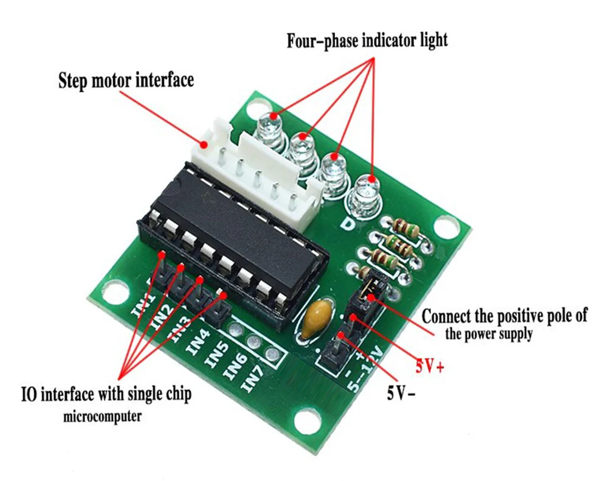
#ຕົວຢ່າງການນຳໃຊ້ 
Stepper Motor Driver Board ແມ່ນສ່ວນປະກອບທີ່ຂາດບໍ່ໄດ້ໃນທຸກລະບົບທີ່ໃຊ້ Stepper Motor ເພື່ອຄວບຄຸມຕຳແໜ່ງດ້ວຍຄວາມຊັດເຈນ.

|**ຫົວຂໍ້ການນຳໃຊ້**|**ບົດບາດຂອງ Driver**|
|---|---|
|**3D Printers/CNC Machines**|**ຄວບຄຸມແກນ X, Y, Z:** Driver (ເຊັ່ນ: DRV8825) ຮັບ Pulses ຈາກແຜງຄວບຄຸມຫຼັກ (Main Board) ແລະ ປ່ຽນມັນໃຫ້ເປັນການເຄື່ອນທີ່ຂອງມໍເຕີຢ່າງຊັດເຈນ (Microstepping) ເພື່ອໃຫ້ໄດ້ຕຳແໜ່ງທີ່ຖືກຕ້ອງ.|
|**Robotics & Automation**|**ການຄວບຄຸມສາຍພານ/ເຄື່ອງປ້ອນ:** ໃຊ້ Driver ເພື່ອກໍານົດຄວາມໄວ ແລະ ຕຳແໜ່ງຂອງສາຍພານລໍາລຽງ ຫຼື ອຸປະກອນປ້ອນອາຫານດ້ວຍຄວາມຊັດເຈນ.|
|**ອຸປະກອນທາງການແພດ**|**ເຄື່ອງສູບ (Pumps) & ເຄື່ອງຈ່າຍຢາ:** ໃຊ້ Driver ເພື່ອຄວບຄຸມມໍເຕີທີ່ຂັບເຄື່ອນເຄື່ອງສູບຂອງແຫຼວໃນປະລິມານທີ່ຊັດເຈນຫຼາຍ.|
|**ລະບົບປັບໄຟໜ້າລົດ**|**ການປັບມຸມໄຟໜ້າອັດຕະໂນມັດ:** Driver ຮັບສັນຍານຈາກ ECU ຂອງລົດ ແລະ ຂັບເຄື່ອນ Stepper Motor ເພື່ອປັບມຸມສາຍໄຟໜ້າຕາມຄວາມເໝາະສົມ.|

## 39. Real-time Clock Module DS1302
 ແມ່ນ Real-Time Clock (RTC) Chip ຫຼື Module (ອຸປະກອນໂມງເວລາຈິງ) ທີ່ອອກແບບມາເພື່ອຮັກສາ ວັນທີ ແລະ ເວລາທີ່ຊັດເຈນ ຢ່າງຕໍ່ເນື່ອງ, ເຖິງແມ່ນວ່າລະບົບຫຼັກ (ເຊັ່ນ: Arduino ຫຼື Microcontroller) ຈະຖືກປິດໄຟຟ້າກໍຕາມ. ມັນນັບວິນາທີ, ນາທີ, ຊົ່ວໂມງ, ວັນທີ, ເດືອນ, ວັນໃນອາທິດ, ແລະ ປີ, ພ້ອມທັງສາມາດປັບປີອະທິກະສູດ (Leap Year) ອັດຕະໂນມັດໄດ້ເຖິງປີ 2100. ໃຊ້ໃນໂປຣເຈັກທີ່ຕ້ອງການ ການຕິດຕາມເວລາເຊັ່ນ: ໂມງ ຫຼື ບັນທຶກເວລາການໃຊ້ງານ DS1302 ຕິດຕໍ່ສື່ສານກັບ Microcontroller ຜ່ານລະບົບ Serial Communication ທີ່ງ່າຍດາຍທີ່ເອີ້ນວ່າ **3-Wire Interface** (Three-Wire Interface).
#### ຫຼັກການເຮັດວຽກ:
1. **ການນັບເວລາຢ່າງຊັດເຈນ:**
    - RTC ໃຊ້ຄວາມຖີ່ຄົງທີ່ຂອງ 32.768 kHz Crystal ແລະວົງຈອນແບ່ງຄວາມຖີ່ (Frequency Divider) ພາຍໃນເພື່ອປ່ຽນຄວາມຖີ່ດັ່ງກ່າວໃຫ້ເປັນ 1 Hz (1 Pulse ຕໍ່ວິນາທີ) ເພື່ອໃຊ້ໃນການນັບເວລາ.
2. **ການຕິດຕໍ່ສື່ສານ (Interface):**
    - ການສື່ສານກັບ Microcontroller ໃຊ້ພຽງ 3 ສາຍເທົ່ານັ້ນ:
        - **CE (Chip Enable ຫຼື RST):** ໃຊ້ເພື່ອເລີ່ມຕົ້ນແລະສິ້ນສຸດການສື່ສານ.
        - **I/O (Data Input/Output):** ສາຍຂໍ້ມູນທີ່ໃຊ້ສົ່ງ ແລະ ຮັບຂໍ້ມູນເວລາ/ວັນທີ
        - **SCLK (Serial Clock):** ສາຍ Clock ທີ່ຊິ້ງ (Synchronize) ການສົ່ງຂໍ້ມູນ.
3. **ລະບົບໄຟຟ້າສອງແຫຼ່ງ (Dual Power Supply):**
    - DS1302 ມີສອງ Power Pins ຄື VCC1 (ໄຟຟ້າສຳຮອງ/ແບັດເຕີຣີ) ແລະ VCC2 (ໄຟຟ້າຫຼັກຈາກລະບົບ).
    - ອຸປະກອນຈະເຮັດວຽກໂດຍໃຊ້ແຫຼ່ງພະລັງງານທີ່ມີ Voltage ສູງກວ່າ.
    - ເມື່ອໄຟຟ້າຫຼັກ (VCC2) ຖືກຕັດ, ໂມດູນຈະສະຫຼັບໄປໃຊ້ພະລັງງານຈາກແບັດເຕີຣີສຳຮອງ (VCC1) ໂດຍອັດຕະໂນມັດ, ເຮັດໃຫ້ໂມງຍັງຄົງນັບເວລາຕໍ່ໄປໂດຍບໍ່ມີການຢຸດ.
    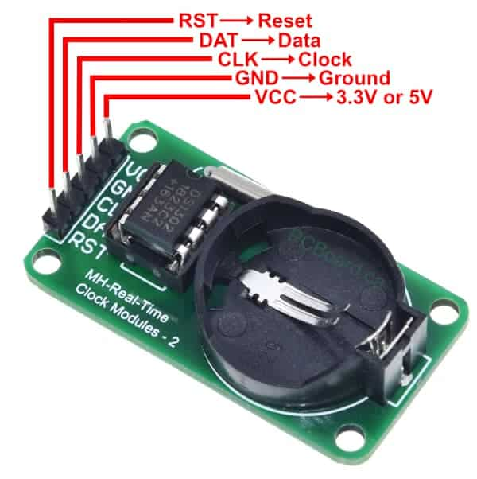
    #ຕົວຢ່າງການນຳໃຊ້ 
    DS1302 RTC ຖືກນໍາໃຊ້ໃນທຸກໂຄງການທີ່ຕ້ອງການຄວາມຖືກຕ້ອງຂອງວັນທີແລະເວລາທີ່ບໍ່ຂຶ້ນກັບການເຊື່ອມຕໍ່ອິນເຕີເນັດ ຫຼື ໄຟຟ້າຫຼັກ.

|**ຫົວຂໍ້ການນຳໃຊ້**|**ລາຍລະອຽດການນຳໃຊ້**|
|---|---|
|**Data Logger (ເຄື່ອງບັນທຶກຂໍ້ມູນ)**|ໃຊ້ເພື່ອປະທັບເວລາ (Time-Stamp) ໃສ່ຂໍ້ມູນທີ່ເກັບໄດ້ (ເຊັ່ນ: ອຸນຫະພູມ, ຄວາມຊຸ່ມຊື່ນ) ເພື່ອໃຫ້ຮູ້ວ່າຂໍ້ມູນນັ້ນຖືກເກັບໃນເວລາໃດ.|
|**ລະບົບຈັບເວລາ ແລະ ຕັ້ງປຸກ**|**ໂມງດິຈິຕອນ ແລະ ໂມງປຸກ:** ເຮັດໜ້າທີ່ເປັນ Clock ຫຼັກໃນການສະແດງເວລາໃນຈໍສະແດງຜົນ, ແລະ ໃຊ້ເພື່ອກໍານົດເວລາປຸກທີ່ແນ່ນອນ.|
|**ລະບົບ Timer ຄວບຄຸມອັດຕະໂນມັດ**|**ເຄື່ອງຄວບຄຸມຫົດນ້ຳຕົ້ນໄມ້/ປິດ-ເປີດໄຟ:** ໃຊ້ RTC ເພື່ອເປີດລະບົບໃນເວລາທີ່ກຳນົດໄວ້ເຊັ່ນ: ເປີດໄຟຕາມຖະໜົນໃນເວລາ 18:00 ແລະ ປິດໃນເວລາ 06:00.|
|**ເຄື່ອງກວດສອບການເຂົ້າ-ອອກ**|**ເຄື່ອງສະແກນລາຍນິ້ວມື/ບັດ:** ໃຊ້ RTC ເພື່ອບັນທຶກເວລາທີ່ພະນັກງານເຂົ້າ ແລະ ອອກຈາກຫ້ອງການດ້ວຍຄວາມຊັດເຈນ.|

## 40. 74HC595 Chip
40. ແມ່ນຊິບທີ່ໃຊ້ໃນການຂະຫຍາຍຈຳນວນພິນເອົ້າພຸດຂອງ Arduino. ມັນຖືກນໍາໃຊ້ເພື່ອ **ຂະຫຍາຍຈໍານວນ Output Pins** ຂອງ Microcontroller (ເຊັ່ນ: Arduino ຫຼື ESP32). ໂດຍປົກກະຕິແລ້ວ, ທ່ານສາມາດໃຊ້ 74HC595 ໂຕດຽວເພື່ອຄວບຄຸມ 8 Output Pins ດ້ວຍການໃຊ້ພຽງ **3 Pins** ຂອງ Microcontroller ເທົ່ານັ້ນ. ໃຊ້ສຳລັບຄວບຄຸມ LED ຫຼື ອຸປະກອນຈຳນວນຫຼາຍໂດຍໃຊ້ພິນນ້ອຍລົງ 74HC595 ປະກອບດ້ວຍ Registers ພາຍໃນສອງອັນທີ່ເຮັດວຽກປະສານກັນ: Shift Register ແລະ Storage Register.
#### ຫຼັກການເຮັດວຽກ:
1. **ການສົ່ງຂໍ້ມູນເຂົ້າແບບ Serial (Serial In):**
    - **SER (Serial Data Input):** ຂໍ້ມູນ (0 ຫຼື 1) ຈະຖືກສົ່ງເຂົ້າໄປທາງ Pin ນີ້ເທື່ອລະ Bit (One Bit at a Time) ຈາກ Microcontroller.
    - **SRCLK (Shift Register Clock):** ທຸກຄັ້ງທີ່ Clock Signal ປ່ຽນຈາກ LOW ເປັນ HIGH (Rising Edge), Shift Register ຈະຍ້າຍ (Shift) ຂໍ້ມູນທີ່ມີຢູ່ພາຍໃນໄປທາງຂວາ 1 Position ແລະ ຮັບ Bit ໃໝ່ທີ່ຢູ່ SER ເຂົ້າມາໃນ Position ທໍາອິດ.
    - ຂະບວນການນີ້ຈະຖືກເຮັດຊ້ຳ 8 ເທື່ອເພື່ອບັນຈຸຂໍ້ມູນ 8-bit ເຂົ້າໄປໃນ Shift Register ຢ່າງສົມບູນ.
2. **ການສົ່ງຂໍ້ມູນອອກແບບ Parallel (Parallel Out):**
    - RCLK (Register Latch Clock): ເມື່ອຂໍ້ມູນ 8-bit ຖືກໂຫຼດເຂົ້າໄປໃນ Shift Register ແລ້ວ, Microcontroller ຈະສົ່ງ Pulse ໄປຫາ RCLK Pin.
    - Pulse ນີ້ຈະເຮັດໃຫ້ຂໍ້ມູນທັງ 8 bits ທີ່ຢູ່ໃນ Shift Register ຖືກສຳເນົາໄປໃສ່ Storage Register **ໃນເວລາດຽວກັນ**.
    - Q0 ຫາ Q7: Storage Register ແມ່ນເຊື່ອມຕໍ່ໂດຍກົງກັບ 8 Output Pins (Q0 ຫາ Q7), ເຊິ່ງຈະສະແດງສະຖານະ (HIGH ຫຼື LOW) ຂອງຂໍ້ມູນທີ່ຖືກໂຫຼດເຂົ້າມາທັນທີ.
3. **QH' (Serial Out):** Pin ນີ້ຈະສົ່ງ Bit ສຸດທ້າຍທີ່ຖືກຍ້າຍອອກຈາກ Shift Register. ມັນຖືກນໍາໃຊ້ເພື່ອເຊື່ອມຕໍ່ (Cascade) 74HC595 ໂຕຕໍ່ໄປ, ໂດຍການເຊື່ອມຕໍ່ QH' ຂອງໂຕທີ 1 ເຂົ້າກັບ SER ຂອງໂຕທີ 2.

|Pin|ໜ້າທີ່|ລາຍລະອຽດ|
|---|---|---|
|SER (DS)|Data Input|ຮັບຂໍ້ມູນ Serial ເທື່ອລະ bit.|
|SRCLK (SHCP)|Shift Clock|ຄວບຄຸມການຍ້າຍຂໍ້ມູນເຂົ້າໃນ Shift Register.|
|RCLK (STCP)*|Latch Clock|ຄວບຄຸມການສະແດງຂໍ້ມູນອອກ Output Pins (Q0-Q7).|
|Q0 - Q7|Parallel Output|8 Output Pins ທີ່ຄວບຄຸມອຸປະກອນພາຍນອກ.|

#ຕົວຢ່າງການນຳໃຊ້ 
 74HC595 ເປັນທີ່ນິຍົມໃນການນໍາໃຊ້ເພື່ອເພີ່ມ Output ໃຫ້ກັບ Microcontroller ໂດຍປະຢັດ Pins ໃຫ້ຫຼາຍທີ່ສຸດ.

|**ຫົວຂໍ້ການນຳໃຊ້**|**ລາຍລະອຽດການນຳໃຊ້**|
|---|---|
|**LED Array/Display Driver**|**ການຄວບຄຸມໄຟ LED ຈໍານວນຫຼາຍ:** ໃຊ້ 74HC595 ໂຕດຽວເພື່ອຄວບຄຸມໄຟ LED 8 ດອກ ຫຼື ໃຊ້ຫຼາຍໂຕເພື່ອເຮັດເປັນ LED Matrix ຂະໜາດໃຫຍ່ (ເຊັ່ນ: 8x8 LED Matrix) ໂດຍໃຊ້ພຽງ 3 Pins ຂອງ Microcontroller.|
|**7-Segment Display**|**ການສະແດງຕົວເລກຫຼາຍຫຼັກ:** ໃຊ້ 74HC595 ເພື່ອຄວບຄຸມແຕ່ລະຫຼັກ (Digit) ຂອງ 7-Segment Display ທີ່ຕ້ອງການ 7 ຫຼື 8 Output Pins ຕໍ່ Digit ເພື່ອສະແດງຕົວເລກ.|
|**ການຄວບຄຸມ Relay/Motor Driver**|**ລະບົບຄວບຄຸມອັດຕະໂນມັດ:** ໃຊ້ 8 Output Pins ຂອງ 74HC595 ເພື່ອຄວບຄຸມ Relay Module 8 Channels ເພື່ອເປີດ-ປິດເຄື່ອງໃຊ້ໄຟຟ້າ ຫຼື ຄວບຄຸມ Stepper Motors ຫຼາຍອັນ.|
|**Digital Buffer/Data Latch**|**ການເກັບຮັກສາສະຖານະຊົ່ວຄາວ:** ໃຊ້ Storage Register ເພື່ອເກັບສະຖານະຂອງຂໍ້ມູນ 8-bit ໄວ້ຈົນກວ່າຈະມີການອັບເດດໃໝ່.|